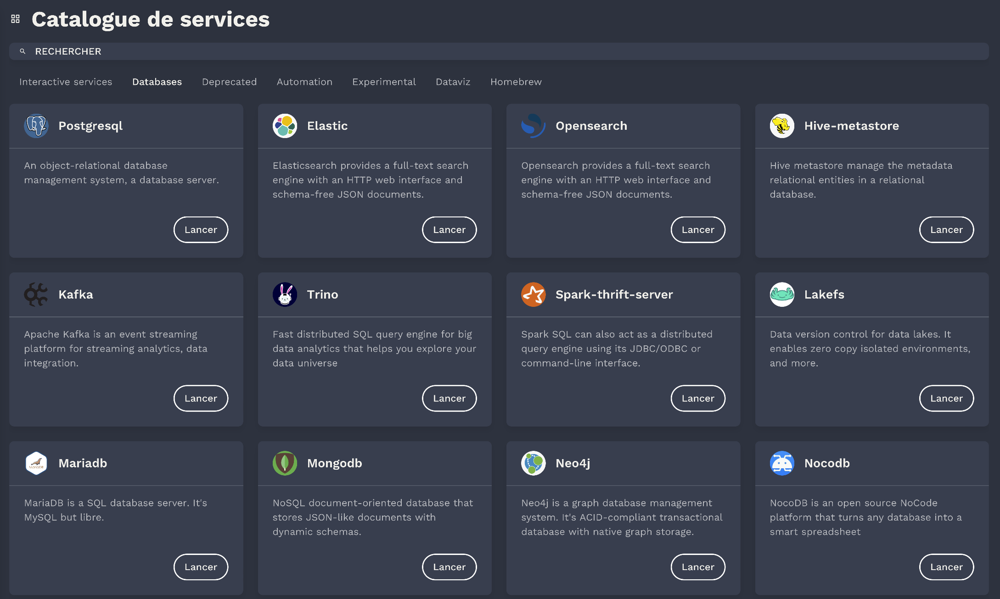
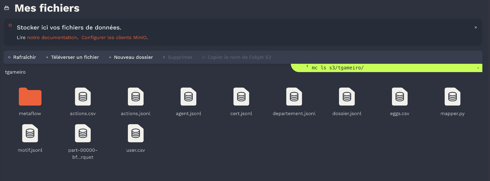
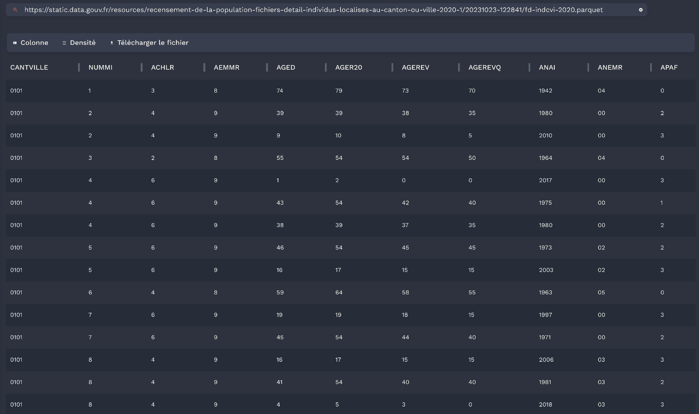
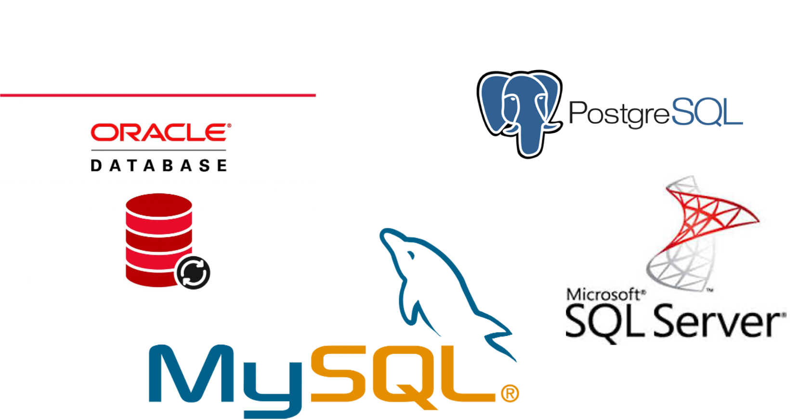
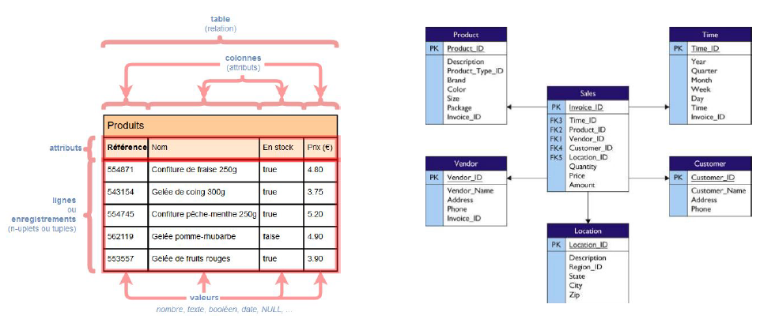
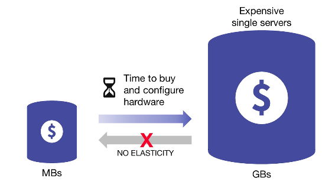
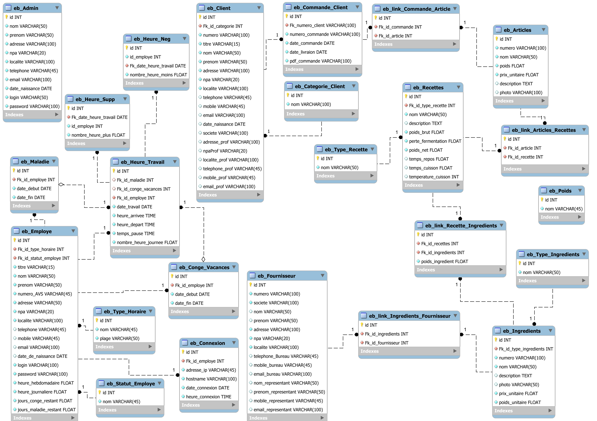
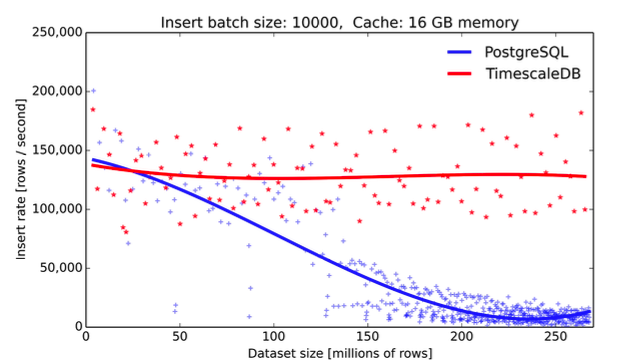

# NoSQL et systèmes distribués

## 1. Introduction et prise en main d'Onyxia

  
Thierry GAMEIRO MARTINS

---
<!-- paginate: true -->

# Plan du cours

> 1. Introduction et prise en main d'Onyxia
2. Le stockage des données en NoSQL
3. Les systèmes distribués : Hadoop et Kubernetes
4. Le passage en production
5. L'orchestration et l'automatisation

---
# Modalité d'évaluation

---

## Objectifs

Présenter par groupe (de 4 ou 5 personnes) un POC (*Proof of Concept*) d'une chaîne de traitement de la données comme solution pour un client

- **Présentation des travaux** : exposé de 15 minutes
- **Questions/réponses** : 10 minutes de question individuelles
- **Livrable** : Powerpoint détaillant votre solution à envoyer avant le jour de la présentation

---

## Barème

- Présentation du sujet choisi
- Choix de la problématique et comment la solution y répond **avec réalisme**
- Les différentes étapes de traitements de la donnée (pré-processing, collecte, valorisation ou d'exposition de la donnée)
- Présenter les différentes briques techniques et fonctionnelles choisies
- Etude comparative des technologies considérées pour chacune des étapes (extraction, stockage, traitement, valorisation, etc.)

---

## Sujets

- 6 sujets proposés
- Possibilité de proposer son propre sujet (à valider avant)
- Date limite pour le choix du sujet

---

## Liste des sujets

- Analyse de tweets https://tinyurl.com/y5v4j8f6
- Parsing de données IOT (Airparif) https://tinyurl.com/y6xdod7p
- Analyse des données de disponibilité des vélib à Paris https://tinyurl.com/yykzr6hv
- Analyse des données de subventions aux associations parisiennes https://tinyurl.com/y5be9ynp
- Analyse et comparaison des trajets uber / Taxi à New York https://tinyurl.com/y29k2jco
- Système de recommandation de Films https://tinyurl.com/v2oynmf

---

# Prise en main d'Onyxia

---

**Onyxia** est une application web développé par l'INSEE qui permet aux data scientists de :

- Lancer des services (éditeur de code, base de données, outils d'orchestration, etc.)
- D'explorer des données
- S'initier à Kubernetes
- Se former en Data Science

> Lien pour se connecter disponible sur : https://datalab.sspcloud.fr

  
  

---

## Catalogue de services

- **Base de données** (MongoDB, Opensearch, PostgreSQL, etc.)
- **Outils d'orcherstration** (ArgoCD, Argo Workflow, MLFlow etc.)
- **Environnement de développement** (Jupyter, VSCode)
- **Data visualisation** (Superset, Redash)

> Configurable (initscript, ressources, stockage, git, secret, etc.)

  

---

## Stockage des secrets et fichiers

- **Un explorateur S3** est disponible pour envoyer des fichiers ou récupérer ses fichiers depuis le Datalab
- **Un outil d'exploration de données** pour visualiser directement des fichiers au format `.csv` ou `.parquet`

- **Un gestionnaire de secret** pour les injecter dans les services

- **Gestion des configurations** (git, customisations de services, etc.)

---

##  Exercice

1. Se connecter à Onyxia et s'y inscrire avec ses identifiants de l'Université (`Paris-Saclay` ou `Evry`)
2. Télécharger un fichier `.csv` sur `data.gouv.fr`, l'importer dans l'explorateur de fichier S3 et le consulter via l'exporateur de données

3. Lancer un service `jupyter-python` et changer la configuration `role` dans l'onglet `Kubernetes` en `admin`. Lancer ensuite un service `PostgreSQL`

4. Créer un notebook et récupérer vos données depuis le S3 avec les commandes suivants :
   1. Lister les fichiers `!mc ls s3/<nom utilsateur>`
   2. Télécharger le fichier `!mc cp s3/<nom utilisateur>/<nom du fichier> ./`

---

# 4. Introduction : le fondement du NoSQL

---

## Les bases de données relationnelles

Les base de données relationnels (*SGBDR*)
- Logiciel de gestion de données régit par des **transactions** et des **schémas de données**
- Organise les données en **tables** reliées par des **relations**
- Interrogeable par du **SQL** : *Structured Query Langage*

---

---

## Les contraintes ACID

- **Atomicité** : Une transaction se fait au complet ou pas du tout, sinon remettre les données dans l’état où elles étaient (rollback)

- **Cohérence** : Tout changement doit être valide selon toutes les règles définies en base (contraintes d’intégrité)

- **Isolation** : Toute transaction doit s’exécuter comme si elle était la seule sur le système. Aucune dépendance possible entre les transactions

- **Durabilité** : Lorsqu’une transaction a été confirmée, elle demeure enregistrée

---

## Les limites des SGBDR

- **Scalabilité horizontale limitée** : difficulté sur la montée en charge et *sharding* complexe

- **Coût élevé** : généralement sous licence et assez cher, nécessite des moyens conséquents pour être résilient

---

- **Complexité de gestion** : complexe dans de grands environnements, flexibilité très faible, et nécessite une expertise pointue

- **Gestion des données non structurées** : optimisés pour les données structurée et des schémas bien définis (JSON, images, vidéos, etc. sont difficiles à stocker)

---

**Performance sur de la volumétrie** : perfomance plus faible sur de grand volumes pour les jointures ou l'insertions de données

---

## Qu'est ce que le NoSQL ?

- NoSQL pour *Not Only SQL*
- Pas de schéma de données et gestion de données complexes ou imbriquée
- Utilise les propriété **BASE** :
  - **Basically Available** : toujours disponible
  - **Soft-state** : pas de schéma fixe
  - **Eventually Consistent** : la donnée finira par être cohérente (*ex : mise à jour du profil sur les réseau sociaux*)

---

## 3 propriétés qui caractérisent les base de données

- **Consistency ou Cohérence** : tous les nœuds du système voient exactement
les mêmes données au même moment

- **Availability ou Disponibilité** : toutes les requêtes reçoivent une réponse

- **Partition tolerance ou Distribution** : le système étant partitionné (ou distribué), aucune panne moins importante qu’une coupure totale ne l’empêche de répondre

> Théorème de CAP (Brewer, 2000) :
*"Dans un système distribué, il est impossible d’obtenir ces 3 propriétés en même temps"*

---

