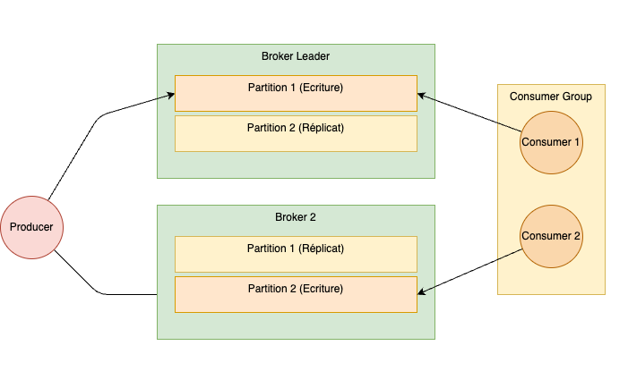

# NoSQL, systèmes distribués et passage en production de projets Data


<br/><br>
**Thierry GAMEIRO MARTINS**

---
<!-- paginate: true -->
<!-- footer: '' -->

## Séances

1. Introduction et prise en main d'Onyxia
2. Le stockage des données en NoSQL
> **3. Les systèmes de traitement distribués**
4. Le passage en production
5. Orchestration et pratique DevOps
6. Déploiement conteneurisé sous Kubernetes


---
# L'écosysteme Hadoop

---

## # Concept : Architecture worker/master


---

## Le framework Hadoop

<div class="columns"> <div>

Hadoop est un framework pour :
- le **stockage** (HDFS)
- le **traitement** (MapReduce) de grands ensemble de données

Utilise la puissance de multiple machines *commodity hardware*


D’autre outils s’intègrent au framework Hadoop (*Hive, Yarn, Spark, Sqoop, Flume, Ambari, etc…*)

</div> <div>


<br>

<br>


</div> </div>


---

## HDFS

<div class="columns"> <div>

- Hadoop Distributed File System (HDFS) est un système de fichier hautement disponible
- Basé de GFS de Google

- Réplique les données sur plusieurs machines pour :
  - la tolérance aux pannes
  - une scalabilité élevée
  - héberger de grands volume de données


</div> <div>

<br>

<br>

<br>


</div> </div>

---

<div class="columns"> <div>

Lorsque un fichier est ajouté le fichier est :
- découpé en bloc
- répliqué vers d’autres nœuds

Le paramètre de réplication par défaut est à 3, et la taille de bloc par défaut est de 128 Mo

</div> <div>

<br>


</div> </div>

---


<div class="columns"> <div>


Ce nœud dit « master » gère via des fichiers de métadonnées (FsImage et EditsLog) :
- l’arborescence et les états du système de fichier (les permissions, les dates, etc.)
- les informations des DataNodes et la position des blocs sous forme d’objet (stocké en mémoire)

</div> <div>


Ce nœud dit « worker » sont les nœuds qui stockent les blocs de données :
- transmettent aux clients les blocs correspondants au fichier demandé
- suppriment, stockent et réplique les blocs
- périodiquement, retourne la liste des blocs qu’ils possèdent (*blockreport*)


</div> </div>

---


## Exercice

Alice, Bob et Carl ont chacun déposé pendant 1 an des données sur HDFS d’une taille journalière de 1024 Mo, mais répartit différemment :

- Alice : 1 fichier de 1024 Mo
- Bob : 8 fichiers de 128Mo
- Carl : 1024 fichiers de 1 Mo

La configuration de leur cluster HDFS est celle par défaut (réplication des blocs à 3 et la taille des blocs à 128 Mo).

Chaque objet stocké sur HDFS requiert 150 octets au NameNode.

**Calculer la consommation en mémoire sur le NameNode de chaque utilisateur au bout d’un an.**


---

## Correction


<div class="columns"> <div>

Alice : 1 fichier de 1024 Mo
- 1 fichier (inode)
- 8 blocs (1024Mo/128Mo) x3
(réplication) = 24
- Total = 25 objets (24+1)*150 octet = 3,75 Ko / jours **Consommation annuelle : 3,75 Ko * 365 = 1,37 Mo**


</div> <div>

Bob : 8 fichiers de 128 Mo
- 8 fichiers (inode)
- 8 blocs (128Mo*8 = 1024Mo)
x 3 (réplication) = 24
- Total = 32 objets (24+8)*150 octet = 4,8 Ko / jours

**Consommation annuelle : 4,8 Ko * 365 = 1,75 Mo**

</div> <div>

Carl : 1024 fichiers de 1 Mo
- 1024 fichiers (inode)
- 1024 blocs x3 (réplication)=
3072
- Total = 4096 objets (3072+ 1024) * 150 octet = 614,4 Ko / jours
**Consommation annuelle : 614,4 Ko * 365 = 224,25 Mo**


</div> </div>


---

*"Small files are big problem in Hadoop" Szele Balint - Cloudera*


<div class="columns"> <div>

**Qu’est ce qu’un petit fichier ?**

Un fichier considérablement plus petit que la taille d’un bloc

</div> <div>

**Une forte consommation mémoire sur le NameNode**

Chaque fichier, répertoire et bloc dans HDFS sont représenté en tant qu’objet occupant 150 octets dans la mémoire du NameNode

> 10M de fichiers utiliseraient environ 6 Go de RAM

</div> <div>

**Un accès à la donnée inefficace**

En général, lorsqu’on stocke des petits fichiers, on en stocke beaucoup


La lecture de nombreux petits fichiers entraîne beaucoup de recherches et de sauts entre les DataNodes


</div> </div>

---


<div class="columns"> <div>


> ### DataNode en panne

1. Communications par *heartbeat* (timeout de 10 minutes), alors :
   - le DataNode est hors service
   - le contenu des blocs hébergées sont indisponibles

2. NameNode planifie alors la création de nouveaux blocs sur d’autres DataNodes

</div> <div>

> ### NameNode en panne

Le NameNode est un *SPOF*
- Installer un *secondary NameNode* qui extrait les modifications et l’état écrit sur le NameNode (*checkpointing*)
- mode HA qui permet d’avoir deux NameNodes (un actif et un passif)
  - Les DataNode envoient des rapports au deux NameNodes
  - Les clients communiquent avec celui actif

</div> </div>

---


---

## Fonctionnement de MapReduce

<div class="columns"> <div>

- Algorithme de traitement de données parallélisé
  - *map* qui traite une paire de clé/valeur en entrée pour générer un autre ensemble de paires de clé/valeur intermédiaire
  - *reduce* qui fusionne toutes les valeurs intermédiaires identiques et qui les renvoi

- Peut résoudre des tâches courantes (calculer une statistique, filtrer, récupérer des index, jointure, etc.)

</div> <div>

<br>

<br>


</div> </div>

---

<div class="columns"><div>

## Fonction *Map*

Applique une fonction à chaque élément de la séquence et retourne la resultat de la séquence transformée

*Exemple*

```python
liste = [1, 2, 3, 4, 5]
map(lambda x: x**2, liste)
# [1, 4, 9, 16, 25]
```

</div> <div>

## Fonction *Reduce*

Appliquer une fonction de manière cumulative aux éléments d'une séquence de façon à réduire la séquence à un seul élément

*Exemple*

```python
liste = [1, 3, 5, 6, 2]

reduce(lambda a, b: a + b, liste)
# 17

reduce(lambda a, b: a if a > b else b, liste)
# 6
```

</div> </div>

---

## Exemple : analyse de la longueur des mots


---

## Lancer un job MapReduce

<div class="columns"> <div>

Un Job MapReduce (MRv1) est divisé en deux services :
- **JobTracker**
    - l’envoi d’application de MapReduce
    - la gestion des ressources
    - l’ordonnancement des jobs

- **TaskTracker**
    - l’execution des jobs Map, Reduce, Shuffle/Sort, etc.


</div> <div>

<br>

<br>

<br>


</div> </div>


---
## YARN (Yet Another Resource Negotiator)


<div class="columns"> <div>

YARN permet de gérer l’allocation des ressources dans un cluster Hadoop (v2)

1. Le Resource Manager déclenche un Application Master sur un Node Manager
2. L’Application Master demandes auprès du Resource Manager des Containers
3. Le Resource Manager récupère informations des blocs pour placer les Containers
4. L’Application Master renvoi le résultat au Resource Manager puis au client


</div> <div>


<br>


</div> </div>


---

## MapReduce : approche bas niveau

<div class="columns"> <div>


- L’approche traditionnelle consiste à utiliser des scripts en Java

- Une librairie python permet aussi de le faire (`mrjob`):
  - Définir un `mapper` et un `reducer`
  - Lancer la commande : `python mr.py -r hadoop hdfs://my_home/input.txt`

> Package utilisé : https://mrjob.readthedocs.io/

</div> <div>


<br>

<br>

Le fichier `mr.py` :


</div> </div>

---

## MapReduce : Pig

<div class="columns"> <div>

Langage haut niveau de traitement de données dans Hadoop
  - *PigLatin* : approche par script
  - *Grunt* : approche interactive


> Un site de démonstration https://www.cloudduggu.com/pig/

</div> <div>


</div> </div>


---
## MapReduce : Sqoop


<div class="columns"> <div>

Transférer des données entre HDFS et des bases de données relationnelles (PostgreSQL, Oracle, MySQL, etc.)

- S'appuie sur la base de données pour décrire le schéma des données à importer
- Utilise MapReduce pour importer et exporter les données par partitions (fonctionnement en parallèle)

</div> <div>

<br>

<br>


</div> </div>

---


---

## MapReduce : Apache Hive


<div class="columns"> <div>


Apache Hive est un data warehouse pour Hadoop
- Permet de manipuler les données comme du SQL avec HiveQL (*HQL*)
- Convertit les requêtes en jobs MapReduce
- Les metadonnées ou metastore sont stockées dans une BDD relationnelle

</div> <div>


<br>

<br>

<br>


</div> </div>


---

# Apache Spark

---

<div class="columns"> <div>


Spark est un moteur de traitement de données distribué :

- Permet de traiter des volumes de données massifs
- Traitement rapide grâce au calcul en mémoire
- Distribué et tolérant aux pannes
- S'intègre à de nombreuses sources de données et supports de stockage

</div> <div>

<br>

<br>

<br>


</div> </div>

---

<div class="columns"> <div>

## Composants

- **SparkContext** : application cliente
- **Driver** : coordonne les tâches et distribue les calculs
- **Executor** : exécute les tâches en parallèle sur les nœuds
- **Resources Manager** : application qui gère les ressources (*nodes*) pour les applications Spark (YARN, Local, Standalone, Kubernetes, Mesos)

> Utiliser `SparkSession` qui est plus simple et intègre le SQL

</div> <div>

<br>


<br>

```python
from pyspark.sql import SparkSession

spark = SparkSession \
    .builder \
    .appName("Python example") \
    .config("spark.config.option", "value") \
    .getOrCreate()
```


</div> </div>


---
## RDD (Resilient Distributed Dataset)


<div class="columns"> <div>

- Structure de données distribuée

- Création à partir :
  - Collection existante
  - Référencer un *dataset* externe (S3, HDFS, fichier, etc.)

> Fichier accesible pour tous les workers

</div> <div>


*Création d'un RDD*

```python
data = [1, 2, 3, 4, 5]
distData = sc.parallelize(data)
```

*Lecture de fichier en RDD*

```python
distFile = sc.textFile("data.txt")
```

> Possible de créer à partir de plusieurs fichiers et de différents formats

</div> </div>

---

## DataFrame vs DataSet

<div class="columns"> <div>

**DataFrame**
- Abstraction structurée des données (similaire à une table)
- Fournit des optimisations pour des requêtes de type SQL

```python
df.printSchema()
df.select("name").show()
df.select(df['name'], df['age'] + 1).show()
df.filter(df['age'] > 21).show()
df.groupBy("age").count().show()
```


```python
df.createOrReplaceTempView("people")

sqlDF = spark.sql("SELECT * FROM people")
```


</div> <div>

**DataSet**
- Combine les avantages des RDD (performance) et DataFrame (forme de table)
- Vérification du typage (au moment de la compilation)
- Exclusivement utilisable en Java ou Scala

</div> </div>

---


## Transformations (*lazy*) et Actions

<div class="columns"> <div>

- **Transformations** : opérations sans effet immédiat (`map`, `filter`, `groupBy`, `join`) et evaluées seulement lorsqu'une action est déclenchée, dites *lazy*

- **Actions** : Déclenchent l'ensemble des transformations à partir d'un plan d'execution (`collect`, `count`, `show`, `save`) et renvoit la valeur

- **Cache** : méthode pour stocker le résultat (`.cache`) pour un accès rapide après une action

</div> <div>


<br>

<br>


</div> </div>

---

## Lire et écrire des données (ETL)


<div class="columns"> <div>


**[Lecture de données](https://spark.apache.org/docs/3.5.3/sql-getting-started.html)**

```python
df = spark.read.json("people.json")
df.show()
# +----+-------+
# | age|   name|
# +----+-------+
# |null|Michael|
# |  30|   Andy|
# |  19| Justin|
# +----+-------+
```

```python
df = (spark
      .read.format("csv")
      .options(header='true',
      inferschema='true', delimiter=',')
      .load("s3a://test.csv")
     )
```


</div> <div>


**[Écriture de données](https://spark.apache.org/docs/3.5.3/sql-data-sources-jdbc.html)**

```python
df.write.format('parquet').save(
    'chemin/vers/dossier')
```

> `format` : spécifie le format d'écriture/lecture (ex. `parquet`, `json`, etc.)

> `mode` : permet de contrôler l'écrasement (`overwrite`), ajout (`append`), etc.


</div> </div>


---

## Spark-Submit vs Spark-Shell

<div class="columns"> <div>

- **Spark-Submit** est un script de commande pour créer des applications Spark dans un cluster
- Configurations spécifiques (nombre d'instances, la mémoire, etc.)

```bash
spark-submit \
  --master k8s://kubernetes.default:443 \
  --deploy-mode cluster \
  --executor-memory 4G \
  /chemin/vers/mon-application.py \
  arg1 arg2
```

</div> <div>

- **Spark-shell** permet de lancer des commandes interactives en Spark
- Pour explorer des données, tester des transformations, etc.


</div> </div>

---

## Spark MLlib

<div class="columns"> <div>

Bibliothèque pour le Machine Learning distribué sur Spark.
  - Contient des algorithmes de classification, régression, clustering, et statistiques
  - Compatible avec les pipelines pour gérer les étapes du flux ML (préparation, entraînement, évaluation)

</div> <div>


*Exemple d'une régression linéaire*

```python
from pyspark.ml.regression import LinearRegression

# Load training data
training = spark.read.format("libsvm")\
    .load("data/mllib/sample_linear_regression_data.txt")

lr = LinearRegression(maxIter=10,
                regParam=0.3,
                elasticNetParam=0.8)

# Fit the model
lrModel = lr.fit(training)
```

> https://spark.apache.org/docs/latest/ml-guide.html

</div> </div>


---

## Spark Streaming

<div class="columns"> <div>

- Traitement de flux en temps réel pour des données en continu
- Utilise du micro-batch pour découper les flux en petites tâches

*Lecture de données en semi temps-réel*

```python
from pyspark.sql import SparkSession

spark = SparkSession.builder \
    .appName("KafkaSparkStreaming") \
    .getOrCreate()

data = spark.readStream \
    .format("kafka") \
    .option("kafka.bootstrap.servers", "kafka:9092")
    .option("subscribe", "mon_topic")
    .load()
```

</div> <div>


</div> </div>


---

# Apache Kafka

---

<div class="columns"> <div>


Kafka est un système de message :
- Permet de gérer des flux de données en temps réel
- Stocke les messages de manière persistante
- Distribué et résilient à la panne
- S'intègre à de nombreuses sources de données

**Quand ?** : évènements, log, metrics, etc.

</div> <div>


- **Producer** : service qui envoit les messages
- **Consumer** : service qui lit les messages
- **Topic** : file de messages
- **Broker** : serveur Kafka
- **Cluster** : ensemble de brokers


</div> </div>


---

## Système de topics et offset


<div class="columns"> <div>

- **Topic** : conteneur de messages pour une catégorie
  - Stockage des messages
  - Plusieurs consumer peuvent lire un même topic

- **Offset** : position d’un message dans un topic
  - Permet aux consommateurs de suivre la progression de lecture
  - Indice stocké dans Kafka
  - Reprise possible par le consumer (commit, *latest* ou *earlier*)

</div> <div>

<br>

<br>


<br>

<br>


</div> </div>


---

## Création de topics


Ou via la CLI
```bash
bin/kafka-topics.sh --create --topic quickstart-events --bootstrap-server localhost:9092
```


---

## Envoyer et recevoir des messages


<div class="columns"> <div>


**Producer**

```python
from kafka import KafkaProducer
import json


producer = KafkaProducer(
    bootstrap_servers=['kafka:9092'],
    value_serializer=lambda v: json.dumps(v).encode('utf-8')
)

producer.send('test_topic', value={'a': 1})

```

Ou via la CLI :

```bash
$ bin/kafka-console-producer.sh
--topic quickstart-events
--bootstrap-server kafka:9092
>This is my first event
>This is my second event
```


</div> <div>


**Consumer**

```python
from kafka import KafkaConsumer
import json

consumer = KafkaConsumer(
    'test_topic',
    bootstrap_servers=['kafka:9092'],
    auto_offset_reset='latest',
    enable_auto_commit=True,
    value_deserializer=lambda x: json.loads(x.decode('utf-8'))
)

for message in consumer:
    print(f"Message reçu : {message.value}")
```

Ou via la CLI :


```bash
$ bin/kafka-console-consumer.sh 
--topic quickstart-events 
--from-beginning 
--bootstrap-server kafka:9092
This is my first event
This is my second event
```


</div> </div>


---

## Partionnement et réplication

<div class="columns"> <div>

- **Partitionnement** :
  - Divise les topics pour distribuer la charge
  - Fonction de hashage pour le partionnement

- **Réplication** :
  - Chaque partition est répliquée (HA)
  - Un des réplicas est élu comme *Leader* (écriture)

</div> <div>


<br>


</div> </div>

---

## Consumer Group

<div class="columns"> <div>

Ensemble de consommateurs de la même entité pour lire un topic

  - Partage de la charge (*1 partition = 1 consumer*)
  - Nécessite de faire attention au surdimensionnement de consumer

</div> <div>




</div> </div>


---

## Kafka Connect

<div class="columns"> <div>

  - Simplifie la connexion de Kafka avec des systèmes externes (bases de données, systèmes de fichiers, etc.)
  - Prend en charge des [**Connectors**](https://docs.confluent.io/platform/current/connect/kafka_connectors.html) pour les sources et les destinations (*sink*)
  - Gère la scalabilité et la tolérance aux pannes


</div> <div>


</div> </div>

---

## Kafka Streams

<div class="columns"> <div>

- Bibliothèque de traitement de flux (Java)
- Permet le traitement de données en continu (transformations, agrégations et jointures)
- Intégré avec Kafka pour une faible latence et une tolérance aux pannes élevée

</div> <div>


</div> </div>


---

## Kafka Bridge

<div class="columns"> <div>


- API qui permet l’accès en tant que producer et consumer à Kafka via le protocole HTTP
- Simplifie l’accès pour des applications ou microservices

*Exemple*

```bash
curl http://kafka:8080/topics
#
[
  {
    "topic":"bridge-quickstart-topic",
    "key":"my-key",
    "value":"sales-lead-0001",
    "partition":0,
    "offset":0
  },
#...
```


</div> <div>


</div> </div>