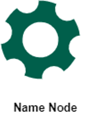

# NoSQL, systèmes distribués et passage en production de projets Data

  
**Thierry GAMEIRO MARTINS**

---
<!-- paginate: true -->
<!-- footer: '' -->

## Séances

1. Introduction et prise en main d'Onyxia
2. Le stockage des données en NoSQL
> **3. Les systèmes de traitement distribués**
4. Le passage en production
5. Orchestration et pratique DevOps
6. Déploiement conteneurisé sous Kubernetes

---
# L'écosysteme Hadoop

---

## # Concept : Architecture worker/master

---

## Le framework Hadoop

 

Hadoop est un framework pour :
- le **stockage** (HDFS)
- le **traitement** (MapReduce) de grands ensemble de données

Utilsie la puissance de multiple machines *commodity hardware*

D’autre outils s’intègrent au framework Hadoop (*Hive, Yarn, Spark, Sqoop, Flume, Ambari, etc…*)

 

 

 

 

 

---

## HDFS

 

- Hadoop Distributed File System (HDFS) est un système de fichier hautement disponible
- Basée de GFS de Google

- Réplique les données sur plusieurs machines pour :
  - la tolérance aux pannes
  - une scalabilité élevée
  - héberger de grands volume de données

 

 

 

 

 

---

 

Lorsque un fichier est ajouté le fichier est :
- découpé en bloc
- répliqué vers d’autres nœuds

Le paramètre de réplication par défaut est à 3, et la taille de bloc par défaut est de 128 Mo

 

 

 

---

 

Ce nœud dit « master » gère via des fichiers de métadonnées (FsImage et EditsLog) :
- l’arborescence et les états du système de fichier (les permissions, les dates, etc.)
- les informations des DataNodes et la position des blocs sous forme d’objet (stockés également en mémoire)

 

Ce nœud dit « worker » sont les nœuds qui stockent les blocs de données :
- transmettent aux clients les blocs correspondants au fichier demandé ;
- suppriment, stockent et réplique les blocs;
- périodiquement,retourne la liste des blocs qu’ils possèdent (blockreport) ;

 

---

## Exercice

Alice, Bob et Carl ont chacun déposé pendant 1 an des données sur HDFS d’une taille journalière de 1024 Mo, mais répartit différemment :

- Alice : 1 fichier de 1024 Mo
- Bob : 8 fichiers de 128Mo
- Carl : 1024 fichiers de 1 Mo

La configuration de leur cluster HDFS est celle par défaut (réplication des blocs à 3 et la taille des blocs à 128 Mo).

Chaque objet stocké sur HDFS requiert 150 octets au NameNode.

**Calculer la consommation en mémoire sur le NameNode de chaque utilisateur au bout d’un an.**

---

## Correction

 

Alice : 1 fichier de 1024 Mo
- 1 fichier (inode)
- 8 blocs (1024Mo/128Mo) x3
(réplication) = 24
- Total = 25 objets (24+1)*150 octet = 3,75 Ko / jours **Consommation annuelle : 3,75 Ko * 365 = 1,37 Mo**

 

Bob : 8 fichiers de 128 Mo
- 8 fichiers (inode)
- 8 blocs (128Mo*8 = 1024Mo)
x 3 (réplication) = 24
- Total = 32 objets (24+8)*150 octet = 4,8 Ko / jours

**Consommation annuelle : 4,8 Ko * 365 = 1,75 Mo**

 

Carl : 1024 fichiers de 1 Mo
- 1024 fichiers (inode)
- 1024 blocs x3 (réplication)=
3072
- Total = 4096 objets (3072+ 1024) * 150 octet = 614,4 Ko / jours
**Consommation annuelle : 614,4 Ko * 365 = 224,25 Mo**

 

---

*"Small files are big problem in Hadoop" Szele Balint - Cloudera*

 

**Qu’est ce qu’un petit fichier ?**

Un fichier considérablement plus petit que la taille d’un bloc

 

**Une forte consommation mémoire sur le NameNode**

Chaque fichier, répertoire et bloc dans HDFS sont représenté en tant qu’objet occupant 150 octets dans la mémoire du NameNode

> 10 millions de fichiers occupant 3 blocs chacun utiliseraient environ 6 Go de mémoire

 

**Un accès à la donnée inefficace**

En général, lorsqu’on stocke des petits fichiers, on en stocke beaucoup

La lecture de nombreux petits fichiers entraîne beaucoup de recherches et de sauts entre les DataNodes

 

---

 

### DataNode en panne

Communications par *heartbeat* (timeout de 10 minutes), alors :
- le DataNode est hors service
- le contenu des blocs hébergées sont indisponibles

NameNode planifie alors la création de nouveaux blocs
sur d’autres DataNodes

 

### NameNode en panne

Le Name Node est un *SPOF*
- Installer un *secondary NameNode* qui extrait les modifications et l’état écrit sur le NameNode (*checkpointing*)
- mode HA qui permet d’avoir deux NameNodes (un actif et un passif)
  - Les DataNode envoient des rapports au deux NameNodes
  - Les clients communiquent avec celui actif

 

---

---

## Fonctionnement de MapReduce

 

- une fonction *map* qui traite une paire de clé/valeur en entrée pour générer un autre ensemble de paires de clé/valeur intermédiaire ;
- une fonction *reduce* qui fusionne toutes les valeurs intermédiaires identiques et qui les renvoi ;

> Peut résoudre de nombres tâches courantes (calculer une statistique, filtrer des données, récupérer des index, joindre des données, etc.)

 

 

 

 

---

 

MapReduce (MRv1) est un composant divisé en deux services :
- **JobTracker**
    - l’envoi d’application de MapReduce
    - la gestion des ressources
    - l’ordonnancement des jobs

- **TaskTracker**
    - l’execution des jobs Map, Reduce, Shuffle/Sort, etc.

 

 

 

 

 

---

## Utiliser MapReduce

 

L’approche traditionnelle consiste à utiliser des scripts Java.

Il existe également un jar qui permet de convertir des script python

 

Approche par flux de données

- *PigLatin* : semblable à du SQL
- *Grunt* : fournit un moyen d’interagir interactivement

 

L’utilisation de Hive qui permet de requêter les données stockés sur HDFS avec du SQL

 

---
## YARN 

 

YARN (Yet Another Resource Negotiator) permet de gérer l’allocation des ressources dans un cluster Hadoop (v2)

1. Le Resource Manager déclenche un Application Master sur un Node Manager
2. L’Application Master demandes auprès du Resource Manager des Containers
3. Le Resource Manager récupère informations des blocs pour placer les Containers
4. L’Application Master renvoi le résultat au Resource Manager puis au client

 

 

 

---
## Sqoop

 

Sqoop est un outil pour transférer des données entre Hadoop et des bases de données relationnelles (PostgreSQL, Oracle, MySQL, etc.)

- S'appuie sur la base de données pour décrire le schéma des données à importer
- Utilise MapReduce pour importer et exporter les données par partitions (fonctionnement en parallèle)

 

 

 

 

---

---

## Apache Hive

 

Apache Hive est un data warehouse pour Hadoop
- Solution open-source (Apache)
- Permet de manipuler les données comme
du SQL : HiveQL (ou HQL)
- Convertit les requêtes HiveQL en jobs MapReduce
- Les metadonnées ou metastore sont stockées dans une BDD relationnelle

 

 

---

---

# Apache Spark

---

# Apache Kafka 

---

