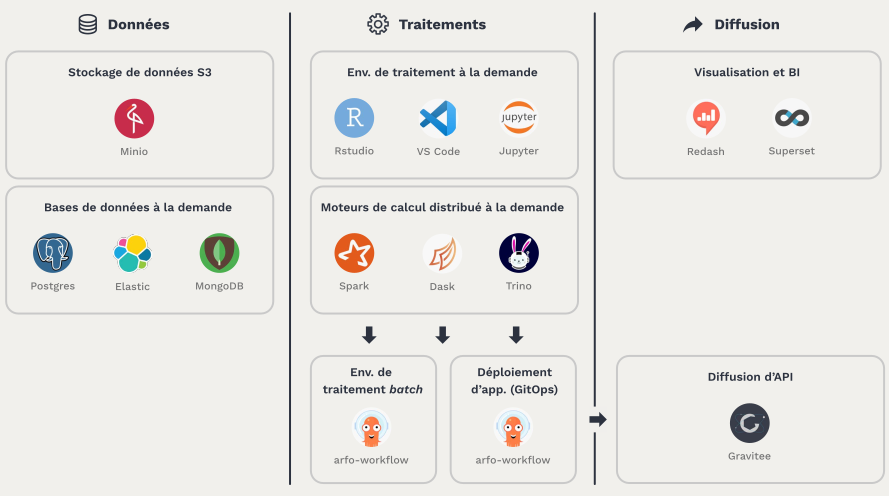

# NoSQL, systèmes distribués et passage en production de projets Data


<br/><br>
**Thierry GAMEIRO MARTINS**

---
<!-- paginate: true -->
<!-- footer: '' -->

## Séances

> **1. Introduction et prise en main d'Onyxia**
2. Le stockage des données en NoSQL
3. Les systèmes de stockage distribués
4. Le passage en production
5. Orchestration par Airflow et pratique DevOps
6. Déploiement conteneurisé sous Kubernetes


---
# Modalité d'évaluation

---

## Objectifs


Présenter par groupe (de 4 ou 5 personnes) un POC (*Proof of Concept*) d'une chaîne de traitement de la données comme solution pour un client


- **Présentation des travaux** : exposé de 15 minutes
- **Questions/réponses** : 10 minutes de questions
- **Livrable** : slides détaillant votre solution, à envoyer avant le jour de la présentation


---

## Barème de la présentation

- Présentation du sujet et de la problématique
- Explication des différentes étapes de traitements de la donnée (collecte, pré-processing, valorisation ou d'exposition de la donnée)
- Les briques technologiques utilisées et les raisons de leurs choix
- Comment la solution répond à la problématique
- Forme de la présentation

---

## Sujets

- 6 sujets sont proposés
- Possibilité de proposer son propre sujet mais à valider en amont
- Date limite pour le choix du sujet avant troisième séance


---

## Quelques sujets


- Analyse de tweets https://tinyurl.com/y5v4j8f6
- Parsing de données IOT (Airparif) https://tinyurl.com/y6xdod7p
- Analyse des données de disponibilité des vélib à Paris https://tinyurl.com/yykzr6hv
- Analyse des données de subventions aux associations parisiennes https://tinyurl.com/mv5fkp5j
- Analyse et comparaison des trajets uber / Taxi à New York https://tinyurl.com/y29k2jco
- Système de recommandation de films https://tinyurl.com/v2oynmf


---

# Introduction au Data Engineering


---


## Qu'est ce que le *Data Engineering* ?

<br>

- **Gérer le cycle de vie de la données** (collecte, traitement et mise à disposition)
- **Garantir** la qualité, l'utilisabilité et la gouvernance des données
- **Concevoir et maintenir** les infrastructures de données (base de données, briques d'ETL, exposition de données, etc.)


---

## Pourquoi est-ce important ?

<br>

- Ne pas se concentrer seulement sur les algorithmes mais aussi au cas d'usage
- Est le socle du *Machine Learning* pour les Data Scientist
- Importance de savoir récupérer, traiter et industraliser des données pour ses projets

---

## Les étapes d'une *pipeline* de données


---

## La collecte des données


Les méthodes de collecte de données varient en fonction de la source, du volume, de la vitesse et des types de données

<div class="columns">
<div>


- **Collecte par API** : récupération de données à la demande en utilisant des requêtes HTTP
> Outils : requests, Postman, `HTTPie`

*Prendre en compte le rate limiting, pas adapté pour de gros volumes, utile pour de l'enrichissement*

</div>

<div>


<br>

- **Extraction de fichiers** : importation de fichiers de différents formats (CSV, JSON, XML, images, vidéos, etc)

> Outils : Apache Nifi, Airflow, Talend

*Solution simple, risque sur le parsing, s'adapter au format*


</div>
</div>

---
## # Concept : les types de données


<div class="columns">
<div>

**Structuré** avec un format fixe (table relationnelles, `csv`, etc.)

<br>

```
firstname,lastname,birthdate,address
Leonardo,DiCaprio,19741111,NY 2 River Terrace
```


</div>
<div>

**Semi-structuré** avec une structure, mais flexible (`JSON`, `XML`)

<br>

```json
{
    "firstname": "Leonardo",
    "lastname": "DiCaprio",
    "birthdate": 19741111,
    "address":
      {"city": "NY",
      "street": "2 River Terrace"}
}
```

</div>
<div>


**Non-structuré** sans format de données (image, texte, vidéos, etc.)

<br>


</div>
</div>

---


<div class="columns">
<div>


- **Collecte en temps réel** : récupération des données en continue

> Outils : Apache Kafka, Apache Flink

*Orienté détection de fraude, surveillance de systèmes*


</div>


<div>

- **Webscraping** : collecte des données des pages web

> Outils : BeautifulSoup, Scrapy, Selenium


*Maintenance difficile, très sensible aux changements, cadre légal encore flou*

</div>
</div>

---

<div class="columns">
<div>


- **Base de données** : mécanismes d’extraction des données de bases de données transactionnelles

> Outils : Sqoop, Debezium, Talend, Spark, Apache Flink, Airflow

*Synchronisation incrémentale (CDC) ou totale, processus souvent lourd et nécessite de la puissance de calcul*

</div>


<div>
</div>
</div>
</div>

---


## Stockage de la donnée

Le stockage des données peut être de différentes formes


<div class="columns">
<div>

- **Bases de données relationnelles** : utilisées pour des données structurées avec des relations bien définies entre tables
> Exemple : MySQL, PostgreSQL, Oracle, SQL Server

*Applications pour du requêtage de système opérationnel (API, web application, etc.)*


</div>

<div>

- **Bases de données NoSQL** : utilisée pour les données semi-structurées, offrant une grande flexibilité

> Exemple : MongoDB, Cassandra, ElasticSearch, Redis

*Applications web ou mobiles en constante évolution, IoT, réseaux sociaux*


</div>
</div>


---


<div class="columns">
<div>

- **Data Warehouse** : stockage de données organisées et optimisées pour du calcul analytique

> Exemple : Amazon Redshift, Google BigQuery, Snowflake, VerticaDB

*Stockage de grandes quantités de données, efficace sur des requêtes analytiques*


</div>

<div>

- **Data Lake** : stockage de données au format brute de tous type

> Exemple : HDFS, Amazon S3

*Utile pour stocker la donnée brute*


</div>
</div>


---

## # Concept : OLAP vs OLTP


|               | OLAP                                           | OLTP                                                     |
| ------------- | ---------------------------------------------- | -------------------------------------------------------- |
| **Défintion** | *OnLine Analytical Processing*                 | *OnLine Transactional Processing*                        |
| **Objectif**  | Traiter le maximum de lignes pour de l'analyse | Lire et modifier les données le plus rapidement possible |
| **Requête**   | Requêtes simples                               | Requêtes complexes                                       |
| **Temps**     | En millisecondes                               | Entre la seconde et la minute                            |
| **Stockage**  | Base relationnelle                             | Data Warehouse                                           |
| **Source**    | Source de la donnée                            | Bases OLTP                                               |

---

## Préparer les données


<div class="columns">
<div>

**Traitement par lots** : les données sont traitées en gros volumes, généralement à des intervalles réguliers
> Exemples : Apache Spark, Apache Hadoop, Data Warehouse en SQL

*Traitement de données historiques, création de rapports, pipelines journalières*

</div>

<div>

**Traitement en temps réel** : les données sont traitées en continu, au fur et à mesure qu’elles sont générées.

>Exemples : Apache Kafka, Apache Flink

*Analyse de données en temps réel (ex. détection de fraude, suivi des événements IoT)*

</div>
</div>

---

## # Concept : ETL vs ELT


<div class="columns">
<div>


**ETL** : les transformations ont lieu **AVANT** le chargement des données


</div>
<div>

**ELT** : les transformations ont lieu **APRÈS** le chargement des données


</div>
</div>


---

## # Concept : Scalabilité Horizontale vs Verticale


---

## # Concept : Architecture Data Lake vs Data Warehouse


---

## Diffuser et exposer les données

<div class="columns">
<div>

Diffuser les données sous la forme de **tableaux de bords** exploitables (*Data Analysis*)


Retravailler la donnée afin de **la redistribuer** sous une forme compréhensible (via API, ou fichiers)

</div>
<div>


</div>
</div>

---

# Prise en main d'Onyxia

---


<style scoped>

.columns {
  column-width: auto;
}
</style>


<div class="columns">
<div>

**Onyxia** est une application web développée par l'INSEE qui permet aux data scientists et data ingénieurs de :

- Lancer des services (éditeur de code, base de données, outils d'orchestration, etc.)
- D'explorer des données et d'entraîner des modèles
- Déployer des applications
- Se former en Data Science

> Lien pour se connecter disponible sur : https://datalab.sspcloud.fr


</div>
<div>


<br><br/>
<br><br/>


</div>
</div>

---

## Catalogue de services


<div class="columns">
<div>

- **Base de données** (MongoDB, Elastic, PostgreSQL, etc.)
- **Outils d'orchestration** (ArgoCD, Argo Workflow, MLFlow etc.)
- **Environnement de développement** (Jupyter, VSCode, RStudio)
- **Visualisation** (Superset, Redash)

> Configurable (initscript, ressources, stockage, git, secret, etc.)

</div>

<div>


</div>
</div>

---

## Stockage des secrets et fichiers


<div class="columns">
<div>


- **Un explorateur S3** est disponible pour envoyer des fichiers ou récupérer ses fichiers depuis le Datalab
- **Un outil d'exploration de données** pour visualiser directement des fichiers au format `.csv` ou `.parquet`

- **Un gestionnaire de secret** pour les injecter dans les services

- **Gestion des configurations** (git, customisations de services, etc.)

</div>
<div>


</div>
</div>

---

##  Un catalogue de services complet pour les projets de data science



---

# Rappel : les bases de données relationnelles
---


<div class="columns">
<div>

Les base de données relationnels (*SGBDR*)
- Logiciel de stockage et de gestion de données régit par des **transactions**
- Organise les données sous la forme d'un **schémas relationnel** visant à éviter la redondance
- Interrogeable par du **SQL** : *Structured Query Langage*


</div>
<div>


</div>
</div>

---

## Schéma relationnel


---

## Les contraintes ACID des SGBDR

<div class="columns">
<div>

- **Atomicité** : Une transaction se fait au complet ou pas du tout, sinon remettre les données dans l’état où elles étaient (rollback)


- **Cohérence** : Tout changement doit être valide selon toutes les règles définies en base (contraintes d’intégrité)

</div>
<div>

- **Isolation** : Toute transaction doit s’exécuter comme si elle était la seule sur le système. Aucune dépendance possible entre les transactions

- **Durabilité** : Lorsqu’une transaction a été confirmée, elle demeure enregistrée


</div>
</div>

---

## Langage SQL


- **DDL** (Data Definition Language) : `CREATE`, `ALTER`, `DROP`
- **DML** (Data Manipulation Language) : `SELECT`, `INSERT`, `UPDATE`, `DELETE`, `JOIN`
- **DCL** (Data Control Language) : `GRANT`, `REVOKE`
- **TCL** (Transaction Control Language) : `COMMIT`, `ROLLBACK`, `SAVEPOINT`


