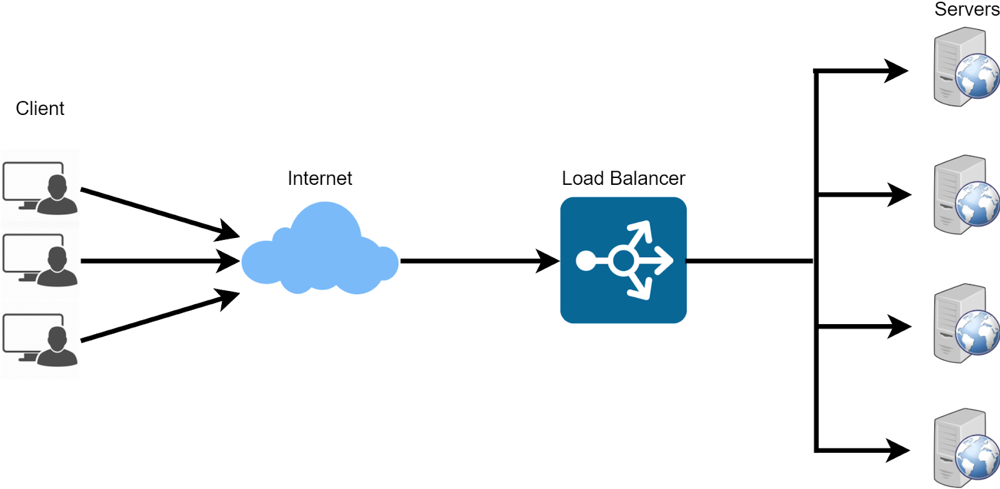
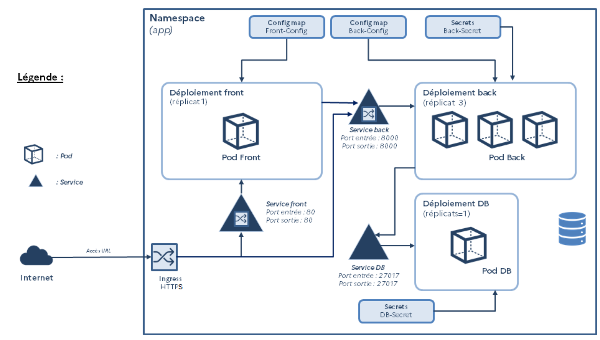

# NoSQL, systèmes distribués et passage en production de projets Data

<br/><br>
**Thierry GAMEIRO MARTINS**

---

<!-- paginate: true -->
<!-- footer: '' -->
# Séances

1. Introduction et prise en main d'Onyxia
2. Le stockage des données en NoSQL
3. Les systèmes de traitement distribués
> **4. Le passage en production**
5. Orchestration et pratique DevOps
6. Déploiement conteneurisé sous Kubernetes

---

# Du POC à l'industrialisation

---

## Proof of Concept

<div class="columns">
<div>

**Qu'est ce c'est ?**

- Prototype limité pour démontrer la faisabilité et la valeur ajoutée
- Évalué dans un environnement isolé et souvent simpliste
- Durée souvent courte

**Pourquoi ?**

- Réduire le risque et la compatibilité
- Permet de tester une nouvelle technologie / méthode
- Convraincre les parties prenantes


</div>
<div>

<br>

<br>

<br>


</div>
</div>

---

## Le passage à l'industrialisation

<div class="columns">
<div>

La phase d’industrialisation dans le domaine de la data est souvent complexe et à fort risque d’échec :

- **Obstacles organisationnels** : gestion de projets, contraintes budgétaires, SSI, RGPD
- **Obstacles sur la valeur** : vulgarisation des résultats, valeurs ajoutées des algorithmes, acculturation « data »
- **Obstacles techniques** : orchestration, monitoring, sécurisation

</div>


<div>


</div>
</div>

---

# Les prérequis à la mise en production

---

## Mise en place des environnements

<div class="columns">
<div>

Pourquoi des environnements multiples ?
- Séparation des phases de développement, de test et de production
- Réduire les risques liés à la propagation d’erreurs
- Faciliter le **debugging** et les tests

> Ces environnements peuvent être nombreux et à la discrétion du projet (pas tous obligatoires)

</div>
<div>

<br>

<br>


</div>
</div>

---


- **Développement**
  - Environnement dédié au développeur qui n’impacte pas les autres environnements.
  - Local (sur un poste) ou distant (via des outils collaboratifs comme Jupyter Lab, Dataiku, etc.)
  - L’accès aux données : données fictives, anonymisées ou scopées

- **Staging**
  - Permet aux développeur de vérifier le fonctionnement d'une nouvelle brique
- **Qualification**
  - Faire tester aux utilisateurs les nouvelles fonctionnalités

---

- **Intégration**
  - Vérifie que les déploiements sont compatibles avec l’infrastructure cible

- **Formation**
  - Plateforme pour former les utilisateurs afin qu'il n'impacte pas la production

- **Pré-production**
  - Environnement iso-production
  - Permet de reproduire les bugs
  - Peut être utilisé comme production de secours

---

<div class="columns">
<div>

**Production**
  - Environnement où fait vivre l'application pour ses utilisateurs
 - Il doit être opérationnel en permanence (disponible selon les SLA et sans bug)

> *SLA : Service Level Agreement*

</div>
<div>

<br>

<br>


</div>
</div>

---

## L'observabilité

<div class="columns">
<div>

1. **Logs**
   - Collecte des événements système et applicatifs
2. **Métriques**
   - Analyse des performances : latence, utilisation CPU, mémoire
3. **Traces**
   - Suivi des flux entre services
4. **Alerting**
   - Envoi des états


> Prometheus, Grafana, ELK, Loki

</div>
<div>


</div>
</div>

---

<div class="columns">
<div>


Le logging ou journalisation est l’enregistrement des événements, des opérations effectuées


**Les types de logs**
- Détection des erreurs et des pannes
- Suivi de l’activité
- Conformité aux réglementations


**Les points d’attention**

- Niveaux de journalisation (ERROR, INFO, WARN, DEBUG, etc.)
- Rotation des journaux (archivage, nettoyage selon une durée, etc.)
- Stockage sécurisé (chiffrement, conformité des données, sensibilité)

</div>
<div>


<br>

<br>


</div>
</div>

---

<div class="columns">
<div>


Le monitoring consiste à surveiller, mesurer le système et à suivre son évolution

- Les performances (nombre de connexions actives, de requêtes, consommation de ressources, etc.)
- Sa disponibilité (fonctionnement du système, downtime, etc.)
- Son intégrité (résultats corrects)

</div>
<div>


*Dashboard Grafana*

</div>
</div>


---


<div class="columns">
<div>

Les traces permettent de suivre le parcours des interactions à travers un système

- Observer les interactions entre les différentes services
- Analyser les éventuels goulots d'étranglements
- Partie la plus avancée dans l'observabilité

</div>
<div>


*Dépendances sur Dynatrace*

</div>
</div>

---

L’alerting est le principe de créer des alerte en cas d’évènements particuliers dans un système (défaillances, bon déroulement d’un *job*)


- Solution à développer pour le cas d’usage (envoi sur des canaux de discussions, mails, etc.)
- Certains outils d’orchestrations embarquent des outils d’alerting
- Les solutions d’observabilités (Elastic,Splunk comportent des plugins d’alerting)
- Technologie qui envoit des alertes

---

## La sécurisation

<div class="columns">
<div>

Plusieurs niveaux à sécuriser :

- L'infrastructure
- Les accès
- La donnée

**Pourquoi** ?
- Se protéger contre les cyberattaques
- Maintenir la continuité
- Garantir la confidentialité des données
- Préserver sa réputation

</div>
<div>


</div>
</div>

---

<div class="columns">
<div>

L’objectif est de sécuriser les points d’entrées et de sorties du système

- **VPN** : tunnel sécurisé entre l'utilisateur et le réseau (confidentialité, connexion à distance)
- **LoadBalancer** : répartit la charges sur plusieurs serveurs (fiabilité)
- **Proxy** : filtre le trafic entrant ou sortant d'une application
- **Firewall** : permet de cloisoiner le réseau
- **API Gateway** : gère le trafic, la limitation du débit, l'authentification

</div>
<div>

<br>

<br>

<br>

<br>

<br>



</div>
</div>

---

<div class="columns">
<div>

La gestion des accès est une composante importante. On distingue :

- **Authentification** : déterminer l’identité d’un utilisateur ou d’un service
- **Autorisation** : identifier les droits d’accès

**Quelques bonnes pratique**

- Le moindre privilège
- Utiliser des comptes de services pour des tâches d’automatisation
- Privilégier l’identification unique (SSO) par rapport aux comptes locaux
- Appliquer de la MFA

</div>
<div>

<br>

<br>

<br>

<br>

<br>


</div>
</div>

---

<div class="columns">
<div>

Chiffrer la donnée dans tous ses états

**Au repos**
- chiffrer les bases de données
- chiffrer les fichiers plats (csv, parquet, etc.)

**En transit**
- En HTTPS pour le transit par le web
- Chiffrer les connexions aux base de données avec du SSL

</div>
<div>


</div>
</div>

---

## La réglementation

<div class="columns">
<div>

- **RGPD** : protection des données personnelles, droit d'accès et suppression pour les utilisateurs
- **PCI-DSS** : sécurisation des transactions bancaires

### Implications techniques
- Collecter uniquement les données nécessaires
- Stocker les données dans des régions autorisées
- Mettre en place des mécanismes d’**anonymisation** ou de **pseudonymisation**

</div>
<div>


</div>
</div>

---

## Tests de performances

<div class="columns">
<div>

- Identifier les goulots d'étranglement
- Garantir la scalabilité pour les volumes de données réels
- Évaluer la résilience face à des pics d’activité

### Types de tests
1. **Tests de charge :** mesurer les performances sous charge normale
2. **Stress tests :** simuler des conditions extrêmes
3. **Tests d’endurance :** évaluer la stabilité sur de longues durées

</div>
<div>

<br>

<br>

<br>


</div>
</div>

---

## Tests fonctionnels et techniques

<div class="columns">
<div>

### Tests fonctionnels
- Vérifier que chaque fonctionnalité respecte les besoins métier
- Appliquer des scénarios types

### Tests techniques
- Vérification du contenu des réponses pour une API
- Vérification de la non-régression

</div>
<div>


</div>
</div>

---

## Audit de sécurité

<div class="columns">
<div>

### Pourquoi auditer ?
- Identifier les vulnérabilités avant une mise en production
- Renforcer la confiance des parties prenantes

### Comment ?
- Simuler des attaques pour évaluer les défenses (*pentest*)
- Analyse du code pour détecter les failles connues
- Audit des configurations système

</div>
<div>

<br>

<br>

<br>


</div>
</div>

---

## La documentation

<div class="columns">
<div>

### Objectifs de la documentation
- Faciliter la maintenance et l’évolutivité
- Permettre une transmission aux nouvelles équipes

### Types de documentation
1. **Technique**
   - Architecture du système
   - Configuration des services
2. **Fonctionnelle** :
   - Modes d'utilisation des outils
   - Cas d’usage métier

</div>
<div>


*Sphinx documentation*

</div>
</div>

---

# Orchestration et pratique DevOps

---

## Présentation de Airflow


---


---


---


---

## Les pratiques DevOps

*Il faut embaucher des « Ops » qui pensent comme des Devs » et des « Devs qui pensent comme des Ops »*

*John Allspaw & Paul Hammond*


<div class="columns">
<div>

**Les principes**
- Des équipes intégrées
- Un outillage automatisé (test unitaire, test d’intégration, déploiement continue, etc.)
- Extension de l’agilité (éviter le cycle en V)

</div>
<div>

<align >

**Les bonnes pratiques**

- Infra as Code (IaaC)
- Pas d’action manuelle
- Suivi de version
- Architecture microservice

</align>

</div>
</div>

---

## Infrastructure as Code


<div class="columns">
<div>

- Création de fichier contenant les caractéristiques souhaités
- Pas besoin de gérer manuellement les serveurs

> Ansible, Terraform

</div>
<div>

**Module Terraform**


</div>
</div>

---

## Continous intégration (CI) et Continous delivery (CD)

<div class="columns">
<div>


- `CI` : Chaque commit déclenche un processus `test, build and release`

  - **Github Action**
  - **GitLab Workflow**

- `CD` : les nouvelles releases sont automatiquement déployées

  - **ArgoCD**


</div>
<div>

`Github Action`

```
jobs:
  build:
    runs-on: ubuntu-latest
    steps:
      -
        name: Login to Docker Hub
        uses: docker/login-action@v3
        with:
          username: ${{ vars.DOCKERHUB_USERNAME }}
          password: ${{ secrets.DOCKERHUB_TOKEN }}
      -
        name: Set up Docker Buildx
        uses: docker/setup-buildx-action@v3
      -
        name: Build and push
        uses: docker/build-push-action@v6
        with:
          push: true
          tags: ${{ vars.DOCKERHUB_USERNAME }}/clockbox:latest
```

</div>
</div>

---


---


# Déploiement conteneurisé sous Kubernetes

---

## Conteneurs vs Machine virtuelles


---

## Présentation de Docker

<div class="columns">
<div>

- **Portable** : il peut-être détruit et reconstruit très rapidement
- **Isolé** : tout comme une machine virtuelle, il permet de créer un environnement dédié, permettant d’éviter les aléas (éviter conflits de versions, seulement le strict nécessaire)
- **Léger** : il ne demande pas autant de ressource qu’une machine virtuelle
- **Standard** : quelque soit l’application, un conteneur se lance de la même manière


</div>
<div>

<br>

<br>


</div>
</div>

---

## Ecrire un Dockerfile

<div class="columns">
<div>


- `FROM` `<image>` : image de base
- `WORKDIR` `<path>` : dossier courant
- `COPY` `<host-path> <image-path>` : copier un fichier dans le conteneur
- `RUN` `<command>` : lance une commande
- `ENV` `<name> <value>` : ajoute une variable d'environnement
- `EXPOSE` `<port-number>` : expose un port
- `USER` `<user-or-uid>` : change d'utilisateur

</div>
<div>

- `CMD` `["<command>", "<arg1>"]` commande par défaut au démarrage


```bash
FROM python:3.12
WORKDIR /usr/local/app

# Install the application dependencies
COPY requirements.txt ./
RUN pip install --no-cache-dir -r requirements.txt

# Copy in the source code
COPY src ./src
EXPOSE 5000

# Setup an app user so the container doesn't run as the root user
RUN useradd app
USER app

CMD ["uvicorn", "app.main:app", "--host", "0.0.0.0", "--port", "8080"]
```
</div>
</div>

---

## Construire une image


<div class="columns">
<div>

Pour construire une image avec un tag dans le dossier courant (`.`)

> Docker lit par défaut le fichier `Dockerfile`

```
docker build -t my-username/my-image .
```


</div>
<div>

Lister les images

```bash
docker image ls
```

Renommer une image

```
docker image tag my-username/my-image
another-username/another-image:v1
```

Publier une image

```
docker push my-username/my-image
```

</div>
</div>


---

## Stockage des images


---

## Gérer son conteneur

<div class="columns">
<div>

Publier un port du conteneur vers le système

```
docker run -d -p 8080:80 nginx
```

Ajouter une variable d'environnement au lancement

```
docker run -e foo=bar postgres
```

Lancer un conteneur détaché en stockant de manière persistente les données

```
docker volume create log-data
docker run -d -v log-data:/logs docker/welcome-to-docker
```


</div>
<div>

Suivre ses conteneurs

```
docker ps
```

Supprimer un conteneur

```
docker rm my-conteneur
```

Lancer un terminal bash dans un conteneur

```
docker exec -it my-conteneur bash
```

Suppression des images inutilisés

```
docker system prune
```

</div>
</div>

---

## Gérer plusieurs conteneurs à la fois


<div class="columns">
<div>

- Outil pour définir la configuration de plusieurs conteneurs à la fois
- Utilise la syntaxe yaml avec avec un fichier `docker-compose.yaml`
- Gestion poussée de la gestion des conteneurs (lancer, arrêter de multiples conteneurs)
- Permet de gérer le build et le run des conteneurs


</div>
<div>


</div>
</div>

---

## Kubernetes : l'orchestrateur de conteneur


---

## Fonctionnement de Kubernetes


---

## Les objets dans Kubernetes


---


---



---

## Créer un Pod


---

## Cas d'usage : Spark sous Kubernetes

<div class="columns">
<div>

Apache Spark peut-être utilisé dans un cluster Kubernetes afin d’exécuter des traitement de données parallèles :
- Spark crée un driver Pod
- Le driver crée ensuite un Pod workers (executors) qui sont chargés d’executer le code
- Les Pods sont ensuite supprimés parle driver Pod

*Note : le driver reste toujours present (dans un état completed) afin de conserver les logs du job*


</div>
<div>


</div>
</div>