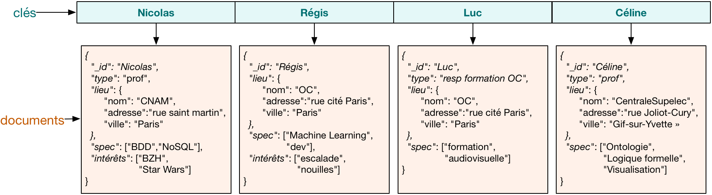

# NoSQL, systèmes distribués et passage en production de projets Data


<br/><br>
**Thierry GAMEIRO MARTINS**

---
<!-- paginate: true -->

# Séances

1. Introduction et prise en main d'Onyxia
> **2. Le stockage des données en NoSQL**
3. Les systèmes de stockage distribués
4. Le passage en productions
5. Orchestration par Airflow et pratique DevOps
6. Déploiement conteneurisé sous Kubernetes
7. Architecture Data et MLOps


---


# Introduction : les fondements du NoSQL
---


## Les limites des SGBDR


<div class="columns">
<div>

- **Scalabilité horizontale limitée** : difficulté sur la montée en charge et *sharding* complexe (partionnement de données)

- **Coût élevé** : beaucoup sont sous licence et assez cher, nécessite des moyens conséquents pour être résilient

</div>
<div>


</div>
</div>

---

<div class="columns">
<div>

- **Complexité de gestion** : gestion difficile dans de grands environnements, flexibilité très faible, et nécessite une expertise pointue


- **Gestion des données non structurées** : optimisés pour les données structurée et des schémas bien définis (JSON, images, vidéos, etc. sont difficiles à stocker)

</div>
<div>


</div>
</div>

---


<div class="columns">
<div>

- **Performance sur de la volumétrie** : perfomance plus faible sur de grands volumes pour les jointures ou l'insertions de données


</div>
<div>


</div>
</div>


---

## Définition du NoSQL


- NoSQL pour *Not Only SQL*

- Utilise les propriété **BASE** :
  - **Basically Available** : toujours disponible *(tolérance aux pannes)*
  - **Soft-state** : pas de schéma fixe (*gestion de données compelexes ou non structurées)*
  - **Eventually Consistent** : la donnée finira par être cohérente (*ex : mise à jour du profil sur les réseau sociaux*)


---

## Définition du NoSQL


- **Flexibilité des schémas** : les données peuvent changer au fil du temps
- **Scalabilité horizontale** : facilité à ajouter des nœuds pour augmenter les capacités
- **Performance** : optimisé pour les grandes quantités de données et les systèmes distribués
- **Adapté aux big data et aux applications modernes** (temps réel, IoT, etc.)

---

## Théorème CAP

Trois propriétés définissent les base de données

- **Cohérence** : tous les nœuds du système voient exactement
les mêmes données au même moment

- **Disponibilité** : toutes les requêtes reçoivent une réponse

- **Distribution** : le système étant partitionné (ou distribué), aucune panne moins importante qu’une coupure totale ne l’empêche de répondre

---

## Théorème CAP

> Théorème de CAP (Brewer, 2000) :
*"Dans un système distribué, il est impossible d’obtenir ces trois propriétés en même temps"*


---

## Théorème CAP


<div class="columns">

<div>
Toutes les requêtes retournent la même donnée sans délais
</div>

<div>
Le système est distribuée et la donnée doit être cohérente à chaque instant, l’accès à la donnée est plus long à cause de la synchronisation
</div>

<div>
La donnée est distribuée et doit être toujours disponible. Les synchronisations sont asynchrone et peut conduire à des incohérences de données (<i>serveur DNS</i>)
</div>
</div>

---


# Les familles de bases de données NoSQL

---

<div class="columns">

<div>

<br>

- **Clé-Valeur** *(Redis, DynamoDB)*
- **Orienté documents** *(MongoDB, ElasticSearch)*
- **Orienté colonnes** *(Cassandra, Vertica, HBase)*
- **Graphes** *(Neo4j)*

</div>

<div>


</div>

</div>


---

## Clé-valeurs

<div class="columns">

<div>


Un système clé-valeur agit comme un dictionnaire
- La clé identifie la donnée de manière unique et permet de la gérer
- La valeur contient n’importe quel type de données
- Performance très élevée en lecture et écriture
- Limité aux opérations **CRUD**

</div>

<div>

<br>

<br>

<br>

<br>


</div>
</div>


---

## Orienté document

<div class="columns">

<div>


Manipule des documents contenant des informations avec une structure complexe (listes, dictionnaires avec imbrications).

- Stucture en forme de document (`JSON`)
- Approche plus structurée que la clé-valeur (possible d'imposer des schémas)
- Propose des langages d’interrogation riches permettant de faire des manipulations complexes

</div>

<div>

<br>

<br>

<br>

<br>



</div>
</div>


---

## Orienté colonne

<div class="columns">

<div>


Système où les données sont lues par colonnes.

- Solution adaptée pour effectuer des traitements sur des colonnes (comptage, moyennes, etc.) mais plus difficile sur des lignes
- Permet une compression plus efficace, réduisant ainsi l’espace disque nécessaire

</div>

<div>

<br>

<br>

<br>

<br>


</div>
</div>


---

## Graphe

<div class="columns">

<div>


Stockent des données sous formes de :
- **nœuds** : représente une entité
- **liens** : la relation entre les entités
- **propriété** : attributs sur les liens

Utile pour faire de la représentation de liens entre des données *(connexion entre utilisateurs sur les réseaux sociaux, relations suspectes entre comptes bancaires, etc.)*

</div>

<div>


</div>
</div>


---

# Redis

---

<div class="columns">

<div>


- **RE**mote **DI**ctionnary **S**erver (https://redis.io)
- Vitesse d’écriture et lecture très élevée
- Base de données légère (en mémoire)

**Quand l'utiliser ?**

- Système de stockage de cache
- Information de sessions (les profils, préférences d’utilisateurs)
- File d'attente

</div>

<div>


**Connexion avec le client python**

```python
import redis

r = redis.Redis(host='redis', port=6379, decode_responses=True)
```

**Stockage de clés en python**


</div>
</div>

---

## Structure des données

<div class="columns">

<div>


**Clé-valeur** : les données sont stockées sous forme de paires **clé-valeur**

```bash
SET mykey "hello"
GET mykey
"hello"
DEL mykey
GET mykey
(nil)
```

* `SET` : associe la clé `mykey` à la valeur `hello`
* `GET` : récupère la valeur associée à `mykey`
* `DEL` : supprime la clé `mykey`

</div>


<div>


Possibilité de faire des enregistrements multiples

```bash
MSET foo1 "bar1" foo2 "bar2" foo3 "bar3"
MGET foo1 foo2 foo3
1) "bar1"
2) "bar2"
3) "bar3"
```


</div>


---


<div class="columns">

<div>

**Hashage** : clés associées à un ensemble de sous-clés et de valeurs, idéal pour des objets complexes

* `HSET` : ajoute des sous-clés et valeurs à un objet
* `HGETALL` : récupère toutes les sous-clés et valeurs associées
* `HKEYS` : affiche toutes les clés

```bash
HSET user:1001 name "Alice" age "30"
HGETALL user:1001
"Alice" "30"
```

</div>
<div>

**Liste** : l'ordre des éléments est conservé, utile pour des files d'attente

* `LPUSH` : ajoute des éléments à la tête de la liste.
* `LRANGE` : récupère les éléments de la liste.
* `LREM` : supprime des valeurs de la liste

```bash
LPUSH tasks "task1"
LPUSH tasks "task2"
LRANGE tasks 0 -1
1) "task1"
2) "task2"
```


</div>


---
## Autres options

<div class="columns">

<div>

**Incrémentation automatique**

* `INCR` : augmente de 1 la valeur de la clé
* `DECR` : diminue de 1 la valeur de la clé

```bash
SET test 1
INCR test
"2"
DECR test
"1"
```

</div>
<div>

**Expiration de clés**

* `EXPIRE` : suprime la clé au bout de *n* secondes
* `TTL` : affiche le *time to live* de la clé
* `SETEX` : crée une clé et lui associe un TTL
```bash
EXPIRE test 60
TTL test
20
SETEX foo 100 "bar"
```

---

<div class="columns">


<div>

**Options d'expiration**

* **NX** : Applique l'expiration uniquement si aucune n'existe
* **XX** : Applique l'expiration uniquement si la clé possède déjà une expiration
* **GT** : Applique l'expiration uniquement si la nouvelle est plus élevée que celle existante
* **LT** : Applique l'expiration uniquement si la nouvelle est moins élevée que celle existante


```bash
EXPIRE foo 10 NX
```


</div>
<div>

**Modification de clé**


* `RENAME` : renome une clé existante
* `APPEND` : ajoute à la clé la valeur associé, si n'existe pas la crée

```bash
SET foo "Hello"
APPEND foo " World"
GET foo
"Hello World"
RENAME foo bar
GET foo
(nil)
GET bar
"Hello World"
```

</div>
</div>

---

## Administration


<div class="columns">

<div>

**Gestion de la configuration**

Il est possible de récupérer la configuration de `redis` et de la modifier

```bash
config get *
config get dbfilename
config set dbfilename "dump2.rdb"
```


</div>

<div>

**Sauvegarde de la base**
* **RDB** (Redis Database File) : Sauvegardes périodiques des données (toutes les 60 secondes si 10 modifications ont été effectuées)

```bash
save 60 10
```

*bgsave permet de lancer des sauvegardes en arrière plan car save est bloquant*
* **AOF** (Append Only File) : Journalisation de chaque opération

```bash
config set appendonly yes
```


</div>
</div>

---

**Abonnement**


<div class="columns">

<div>

Pub/Sub permet à Redis de fonctionner comme un système de messagerie.
* Publier un message sur un canal
* S'abonner à un canal pour recevoir des messages

```bash
PUBLISH mychannel "Hello"
SUBSCRIBE mychannel
UNSUBSCRIBE mychannel
```

</div>
<div>


</div>

</div>


---

## Exercice 1


1. Installer `redis`. Cette base de données ne fait pas partie du catalogue `Onyxia`. Pour l'installer, lancer un terminal puis lancer la commande :
```bash
  kubectl run redis --image redis && kubectl expose pod/redis --port 6379
```

2. Installer la `cli` avec `sudo apt update && sudo apt install redis`

3. Se connecter à `redis` avec la commande `redis-cli -h redis`

4. Créer un hashage  `AA-000-AA` avec comme sous clé `marque` `Mercedes`, `modele` `Classe A` et `annee` `2020`. Lui appliquer ensuite une expiration de 60 secondes.

---

<!-- footer: '' -->

## Exercice 2 : Intégration de Redis avec une API

L'objectif de cet exercice est d'implémenter une API avec le framework [FastAPI](https://fastapi.tiangolo.com/#installation). A partir d'un `id_vehicule`, cette API renvoit l'ensemble des informations associées au véhicule. Les données proviennent de la table `vehicules`. Il faudra implémenter un système de cache si les données renvoyées sont identiques.

**Quelques pistes**

1. Utiliser `pd.read_sql` pour lire les données dans la base (*attention, non recommandé pour un vrai usage*).
2. Filtrer le jeu de données avec l'`id_vehicule` de l'appel API. Il est possible qu'il faille faire des transformations de données intermédiaire.
3. Retourner la ligne pandas sous forme d'un dictionnaire si le véhicule existe, sinon retourner un dictionnaire vide.
4. Pour chaque appel, ajouter les données dans `redis` si elles n'existent pas avec un TTL de 60 secondes. Sinon renvoyer à la place les données du cache.

---

<!-- footer: 'Master 2 IMSD - 2024' -->

# MongoDB

---


<div class="columns">

<div>


- Stocke les données sous forme de documents `JSON` (semi-structuré) dans des collections
- Modèle flexible sans schéma prédéfini
- Scalabilité horizontale
- Stockage compact `Binary JSON` (`BSON`)

**Quand l'utiliser ?**

- Applications nécessitant une flexibilité des schémas
- Applications en temps réel nécessitant des opérations rapides

</div>

<div>

<br>

<br>

**Connexion avec le client Python**

```python
from pymongo import MongoClient

client = MongoClient('mongodb', 27017)

db = client['mydatabase']
```


</div>
</div>

---

## La dénormalisation des données

<div class="columns"> <div>

Les données métiers sont souvent stockées dans un format relationnel (csv, SGBDR, etc.)

> **Dénormalisation** : combiner l'ensemble des données au sein d'un même document plutôt que de diviser les données en plusieurs collections et d'utiliser des jointures

</div> <div>

**:x: Plusieurs documents**

`users`
```json
{
  "_id": 1,
  "name": "Alice"
}
```
`order`

```json
{
  "order_id": 101,
  "user_id": 1,
  "item": "Laptop"
}
```

**:white_check_mark: Un seul document**

`users`

```json
{
  "_id": 1,
  "name": "Alice"
  "orders": [
    {"order_id": 101, "user_id": 1, "item": "Laptop" }
  ]
}
```


</div>
</div>

---

## Opérations CRUD

<div class="columns"> <div>

Ajouter un document à une collection

```bash
db.users.insert_one({"name": "Bob", "age": 25})
```

Récupérer des documents

```bash
db.users.find({"name": "Bob"})
```

Modifier un document existant

```bash
db.users.update_one({"name": "Bob"}, {"$set": {"age": 26}})
````

Effacer un document

```bash
db.users.delete_one({"name": "Bob"})
```

</div>
<div>
</div>
</div>

---