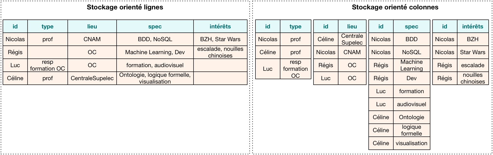
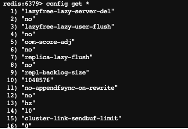

# NoSQL, systèmes distribués et passage en production de projets Data


<br/><br>
**Thierry GAMEIRO MARTINS**

---
<!-- paginate: true -->
<!-- footer: '' -->
# Séances

1. Introduction et prise en main d'Onyxia
> **2. Le stockage des données en NoSQL**
3. Les systèmes de traitement distribués
4. Le passage en production
5. Orchestration et pratique DevOps
6. Déploiement conteneurisé sous Kubernetes


---


# Introduction : les fondements du NoSQL
---


## Les limites des SGBDR


<div class="columns">
<div>

- **Scalabilité horizontale limitée** : difficulté sur la montée en charge et *sharding* complexe

- **Coût élevé** : beaucoup sont sous licence et assez cher, nécessite des moyens conséquents pour être résilient

</div>
<div>


</div>
</div>

---

<div class="columns">
<div>

- **Complexité de gestion** : gestion difficile dans de grands environnements, flexibilité très faible, et nécessite une expertise pointue


- **Gestion des données non structurées** : optimisés pour les données structurée et des schémas bien définis (JSON, images, etc. sont difficiles à stocker)

</div>
<div>


</div>
</div>

---


<div class="columns">
<div>

- **Performance sur de la volumétrie** : perfomance plus faible sur de grands volumes pour les jointures ou l'insertions de données


</div>
<div>


</div>
</div>


---

## Définition du NoSQL


- NoSQL pour *Not Only SQL*

- Utilise les propriétés **BASE** :
  - **Basically Available** : toujours disponible *(tolérance aux pannes)*
  - **Soft-state** : pas de schéma fixe (*gestion de données compelexes ou non structurées)*
  - **Eventually Consistent** : la donnée finira par être cohérente (*ex : mise à jour du profil sur les réseau sociaux*)


---

## Avantages du NoSQL


- **Flexibilité des schémas** : les données peuvent changer au fil du temps
- **Scalabilité horizontale** : facilité à ajouter des nœuds pour augmenter la capacité
- **Performance** : optimisé pour les grandes quantités de données et les systèmes distribués
- **Adapté aux big data et aux applications modernes** : temps réel, IoT, etc.

---

## Théorème CAP

Trois propriétés définissent les base de données

- **Cohérence** : tous les nœuds du système voient exactement
les mêmes données au même moment

- **Disponibilité** : toutes les requêtes reçoivent une réponse

- **Distribution** : le système étant partitionné (ou distribué), aucune panne moins importante qu’une coupure totale ne l’empêche de répondre

---

> Théorème de CAP (Brewer, 2000) :
*"Dans un système distribué, il est impossible d’obtenir ces trois propriétés en même temps"*


---


<div class="columns">

<div>
Toutes les requêtes retournent la même donnée sans délais
</div>

<div>
Le système est distribuée et la donnée doit être cohérente à chaque instant, l’accès à la donnée est plus long à cause de la synchronisation
</div>

<div>
La donnée est distribuée et doit être toujours disponible. Les synchronisations sont asynchrone et peut conduire à des incohérences de données (<i>serveur DNS</i>)
</div>
</div>

---


# Les familles de bases de données NoSQL

---

<div class="columns">

<div>

<br>

- **Clé-Valeur** *(Redis, DynamoDB)*
- **Orienté documents** *(MongoDB, ElasticSearch)*
- **Orienté colonnes** *(Cassandra, Vertica, HBase)*
- **Graphes** *(Neo4j)*

</div>

<div>


</div>

</div>


---

## Clé-valeurs

<div class="columns">

<div>


Un système clé-valeur agit comme un dictionnaire :
- La clé identifie la donnée de manière unique et permet d'en récupérer la valeur
- La valeur contient n’importe quel type de données
- Performance très élevée en lecture et écriture
- Limité aux opérations *CRUD* et non à son analyse

</div>

<div>

<br>

<br>

<br>

<br>


</div>
</div>


---

## Orienté document

<div class="columns">

<div>


Manipule des documents contenant des informations avec une structure complexe (listes, dictionnaires avec imbrications).

- Stucture en forme de document (`JSON`)
- Approche plus structurée que la clé-valeur (possible d'imposer des schémas)
- Propose des langages d’interrogation riches permettant de faire des manipulations complexes

</div>

<div>

<br>

<br>

<br>

<br>


</div>
</div>


---

## Orienté colonne

<div class="columns">

<div>


Système où les données sont lues par colonnes.

- Solution adaptée pour effectuer des traitements sur des colonnes (comptage, moyennes, etc.) mais plus difficile sur des lignes
- Permet une compression plus efficace, réduisant ainsi l’espace disque nécessaire

</div>

<div>

<br>

<br>

<br>

<br>



</div>
</div>


---

## Graphe

<div class="columns">

<div>


Stockent des données sous formes de :
- **nœuds** : représente une entité
- **liens** : la relation entre les entités
- **propriété** : attributs sur les liens

Utile pour faire de la représentation de liens entre des données *(connexion entre utilisateurs sur les réseaux sociaux, relations suspectes entre comptes bancaires, etc.)*

</div>

<div>


</div>
</div>


---

# Redis

---

<div class="columns">

<div>


- **RE**mote **DI**ctionnary **S**erver (https://redis.io)
- Vitesse d’écriture et lecture très élevée
- Base de données en mémoire (rapide)
- Accès par une table *hashage*

**Quand l'utiliser ?**

- Système de stockage de cache
- Information de sessions (les profils, préférences d’utilisateurs)
- File d'attente

</div>

<div>


**Connexion avec le client python**

```python
import redis

r = redis.Redis(host='redis', port=6379,
decode_responses=True)
```

**Stockage de clés en python**


</div>
</div>

---


---

## Structure des données


<div class="columns">

<div>


**Strings** : les données sont stockées sous toutes formes de données (nombres, chaine, image, etc.)

* `SET` : associe une clé à une valeur
* `GET` : récupère la valeur associée
* `DEL` : supprime la clé
* `GETDEL` : lit et supprime la clé ensuite


```bash
SET user:01 "hello"
GET user:01
"hello"
DEL user:01
GET user:01
(nil)
```

</div>


<div>


Possibilité de faire des enregistrements multiples

```bash
MSET foo1 "bar1" foo2 "bar2" foo3 "bar3"
MGET foo1 foo2 foo3
1) "bar1"
2) "bar2"
3) "bar3"
```


> Redis permet une recherche sous la forme `GET user:*`

> `TYPE` commande qui permet de récupérer le type d'une clé

</div>


---

<div class="columns">

<div>

**Hashage** : clés associées à un ensemble de sous-clés et de valeurs accessibles

* `HSET`, `HDEL`, `HGET` : ajoute, récupére ou supprime une sous-clé et une valeur à un objet
* `HGETALL` : récupère toutes les sous-clés et valeurs associées
* `HKEYS` : affiche toutes les clés
* `HEXISTS` : vérifie si une sous-clé existe

```bash
HSET user:1001 name "Alice" age "30"
HGETALL user:1001
"Alice" "30"
```

</div>
<div>

**Liste** : collections d'éléments selon leur ordre saisie

* `LPUSH`, `LPOP` : ajoute ou supprime un élément à la tête de la liste
* `LRANGE` : récupère les éléments de la liste.
* `LINDEX` : récupère la valeur d'une liste à un index

```bash
LPUSH tasks "task1"
LPUSH tasks "task2"
LRANGE tasks 0 -1
1) "task1"
2) "task2"
```

</div>

---

<div class="columns">

<div>

**Set** : collections unique de valeurs non ordonnées, utile pour des comparaisons

* `SADD`, `SREM`, `SGET` : ajoute, supprime ou récupére un élement d'un set
* `SINTER`, `SDIFF` : récupère les valeurs communes ou différentes entre deux sets
* `SISMEMBER` : vérifie pour une clé si la valeur existe

```bash
SADD abo:01 lundi mardi mercredi jeudi
SADD abo:02 lundi dimanche
SINTER abo:01 abo:02
"lundi"
```

</div>
<div>

**Sorted Set** : collections d'éléments ou chaque élément est associé à un score

* `ZADD`, `ZREM` : ajoute ou supprime un élément à la tête de la liste
* `ZRANK`, `ZREVRANK` : obtient le rang associé à une valeur par rapport à son score (ascendant ou descendant)
* `ZRANGE` : permet de générer un top par rapport aux scores des valeurs entre deux index (-1 pour la dernière valeur)

```bash
ZADD gagnants user1 90 user2 30 user3 50
ZRANK gagnants user2
"2"
```


</div>

---
## Autres options

<div class="columns">

<div>

**Incrémentation automatique**

* `INCR` : augmente de 1 la valeur de la clé
* `DECR` : diminue de 1 la valeur de la clé

```bash
SET test 1
INCR test
"2"
DECR test
"1"
```

</div>
<div>

**Expiration de clés**

* `EXPIRE` : suprime la clé au bout de *n* secondes
* `TTL` : affiche le *time to live* de la clé
* `SETEX` : crée une clé et lui associe un TTL
```bash
EXPIRE test 60
TTL test
20
SETEX foo 100 "bar"
```

---

<div class="columns">

<div>

**Options d'expiration**

* **NX** : Applique l'expiration uniquement si aucune n'existe
* **XX** : Applique l'expiration uniquement si la clé possède déjà une expiration
* **GT** : Applique l'expiration uniquement si la nouvelle est plus élevée que celle existante
* **LT** : Applique l'expiration uniquement si la nouvelle est moins élevée que celle existante


```bash
EXPIRE foo 10 NX
```


</div>
<div>

**Modification de clé**


* `RENAME` : renome une clé existante
* `APPEND` : ajoute à la clé la valeur associé, si n'existe pas la crée

```bash
SET foo "Hello"
APPEND foo " World"
GET foo
"Hello World"
RENAME foo bar
GET foo
(nil)
GET bar
"Hello World"
```

</div>
</div>

---


**Gérer les données geospatiales**

<div class="columns">

<div>

Ajouter des données geospatiales

```bash
GEOADD Paris 2.229307 48.896676 "La Defense Arena"
GEOADD Paris 2.321951 48.842138 "Tour Montparnasse"
GEOADD Paris 2.294481 48.858370 "Tour Eiffel"
```
Recherche d'éléments les plus proches selon la localisation

```bash
GEOSEARCH Paris FROMLONLAT 2.322214 48.865840
BYRADIUS 5 Km WITHDIST
1) 1) "Tour Eiffel"
   2) "2.1928"
2) 1) "Tour Montparnasse"
   2) "2.6362"
```

</div>
<div>

Recherche de distance à partir d'un membre

```bash
GEOSEARCH Paris FROMMEMBER "La Defense Arena"
BYRADIUS 10 km WITHDIST
1) 1) "La Defense Arena"
   2) "0.0000"
2) 1) "Tour Eiffel"
   2) "6.3942"
3) 1) "Tour Montparnasse"
   2) "9.0963"
```

</div>
</div>

---

## Administration


<div class="columns">

<div>

**Gestion de la configuration**

Il est possible de récupérer la configuration de `redis` et de la modifier

```bash
config get *
config get dbfilename
config set dbfilename "dump2.rdb"
```



</div>

<div>

**Sauvegarde de la base**
* **RDB** (Redis Database File) : Sauvegardes périodiques des données (toutes les 60 secondes si 10 modifications ont été effectuées)

```bash
save 60 10
```

*bgsave permet de lancer des sauvegardes en arrière plan car save est bloquant*
* **AOF** (Append Only File) : Journalisation de chaque opération

```bash
config set appendonly yes
```


</div>
</div>

---

**Abonnement**


<div class="columns">

<div>

Pub/Sub permet à Redis de fonctionner comme un système de messagerie.
* Publier un message sur un canal
* S'abonner à un canal pour recevoir des messages

```bash
PUBLISH mychannel "Hello"
SUBSCRIBE mychannel
UNSUBSCRIBE mychannel
```

**Quand ?**

- Notifications en temps réel
- Coordination entre services
- Diffusion d'événements système

</div>
<div>


</div>
</div>


---


# MongoDB

---


<div class="columns">

<div>


- Stocke les données sous forme de documents `JSON` (semi-structuré) dans des collections
- Modèle flexible sans schéma prédéfini
- Scalabilité horizontale
- Stockage compact `Binary JSON` (`BSON`)

**Quand l'utiliser ?**

- Applications nécessitant une flexibilité des schémas
- Applications en temps réel nécessitant des opérations rapides

</div>

<div>

<br>

<br>

**Connexion avec le client Python**

```python
from pymongo import MongoClient

client = MongoClient('mongodb', 27017)

db = client['mydatabase']
```


</div>
</div>

---

## La dénormalisation des données

<div class="columns"> <div>

Les données métiers sont souvent stockées dans un format relationnel ou en `csv`

<br>

**Principe de la normalisation**

- Évite la duplication de données
- Assure une meilleure fiabilité de la donnée

> :warning: À éviter dans une base document

</div>
<div>


`orders`

|order_id|name|store_id
|---|---|---|
|0|alex|0|
|1|alice|1|
|2|tom|0|


`store`

|store_id|store_city|store_size
|---|---|---|
|0|Paris|Small
|1|Marseille|Large


</div>
</div>

---


<div class="columns"> <div>


**Dénormalisation**

Combiner l'ensemble des données au sein d'un même document plutôt que d'utiliser des jointures entre documents


</div>
<div>

**Pourquoi ?**


- Stockage à faible coût aujourd’hui
- Référence à plusieurs documents augmente le temps de réponse
- Simplification des requêtes

</div>
</div>


`orders`

```json
{
  "_id": 1,
  "name": "alex"
  "store": {
    {"store_id": 0, "store_city": "Paris", "store_size":"Small"
  }
}
```

---


<div class="columns"> <div>


- **Imbrication de documents** : idéal pour les relations 1-1
- **Référence partielle** : répliquer une partie des informations couramment utilisée et référencer les détails via un id car :
  - **risque des modifications** : couteux si une modification implique de modifier tous les documents
  - **vérifier la taille des document** : dans le cas de relation 1-n, peut alourdir la taille du document (max `16Mo`)

</div>
<div>

```json
{
  "_id": ObjectId("6149eae5a1c2f1001e5e8a23"),
  "title": "How to scale MongoDB",
  "author": {
    "name": "John Doe",
    "job": "Data Scientist"
    "user_id": ObjectId("6149eae5a1c2f1001e5e8b24")
    "address": {
      "city": "Paris",
      "state": "France",
      "zip": "75014"
    }
  },
  "comments": [
    {
      "comment_id": ObjectId("6149eae5a1c2f1001e5e8a25"),
      "text": "Great article!",
      "commenter": {
        "name": "Jane Smith",
        "user_id": ObjectId("6149eae5a1c2f1001e5e8b26")
      },
      "created_at": "2023-09-21T14:15:22Z"
    },
    {
      "comment_id": ObjectId("6149eae5a1c2f1001e5e8a26"),
      "text": "I found it very helpful!",
      "commenter": {
        "name": "Alice Brown",
        "user_id": ObjectId("6149eae5a1c2f1001e5e8b27")
      },
      "created_at": "2023-09-21T14:20:15Z"
    }
  ]
}
```
</div>
</div>

---

## Les types de données MongoDB

MongoDB stocke les données sous le format `BSON` qui permet de stocker davantage d'information que le format `JSON`

<div class="columns">

<div>

**Le type ObjectID**

ID généré par MongoDB est généré à partir de plusieurs facteurs :
- La date d'insertion au sens Unix
- Un nombre aléatoire
- Un compteur par rapport à la valeur insérée

</div>
<div>

D'autres types :
- **Date** afin de manipuler des dates (Timestamp)
- **Entiers** afin de gérer l'espace de stockage (Long, Int32, Decimal128, etc.)

</div>
</div>


---

## Insertion de données

<div class="columns">

<div>


**Ajouter un document**

```bash
db.collection.insertOne({"name": "Alice","age": 25})
```

**Insérer plusieurs documents**

```bash
db.collection.insertMany([{"name": "Bob", "age": 30},
{"name": "Charlie", "age" 35}], { ordered: false })
```

> `ordered`: n’impose pas d’ordre à l’insertion et tente l'ensemble
> `writeConcern` : gestion de la vérification de l'écriture (`majority`, `0`, `1`)

</div>

<div>

Utilisation de `mongoimport` pour de l'import en masse (fichiers CSV, JSON, etc.).

```bash
mongoimport --db mydatabase
--collection mycollection
--file data.json --jsonArray
```

- Très efficace pour de l'import massif
- Supporte différents formats (JSON, CSV)

> MongoDB crée automatiquement les collections lors de la première insertion

</div>
</div>

---

## Recherche de données

<div class="columns">

<div>

**Trouver un document**

```json
db.collection.findOne({ "name": "Alice" })
```


**Trouver plusieurs documents**

```json
db.collection.find({ "age": {"gt": 30} })
```

**Filtrage**

Valeur exacte : `{ "name": "Alice" }`
Sous-clé : `{ "address.city": "Metz" }`
Regex : `{ "name": { $regex: "^A" } }`


</div>
<div>

**Paramètres**

- **Premier paramètre** : critère de recherche
- **Deuxième paramètre** : projection (champ à inclure/exclure) dans la sortie

```json
db.collection.find(
  { "age": { $gt: 30 } },  // critère
  { "name": 1, "age": 1 }   // projection
)
```

> `{ "_id": 0}` pour exclure l'id

</div>
</div>

---


<div class="columns">

<div>

**Comparaisons**

- `$gt` et `$lt` : supérieur ou inférieur
`{ "age": { $gt: 30 } }`
- `$gte` et `$lte` : supérieur/inférieur ou égal à
`{ "age": { $gte: 30 } }`
- `$and` ou `$or` : combinaison `{"age": {"and": [{"$lte": 30}, {"$gte": 40}] }}`
- `$ne` : non égal à
`{ "age": { $ne: 25 } }`

</div>
<div>

**Inclusions/exclusions**

- `$in` : inclus dans une liste
`{ "status": { $in: ["Active", "Pending"] } }`
- `$nin` : non inclus dans une liste
`{ "status": { $nin: ["Banned"] } }`
- `$exists` : si la clé existe
`{ "age": { $exists: 1 } }`

</div>
</div>

---

## Suppression de données

<div class="columns">

<div>

- `deleteOne` : supprime un seul document correspondant au critère
- `deleteMany` : supprime tous les documents correspondant au critère
- Pour supprimer tous les documents d'une collection

</div>
<div>

```json
db.collection.deleteOne({ name: "Alice" })
```

<br>

```json
db.collection.deleteMany({ age: { $lt: 30 } })
```

<br>

```json
db.collection.deleteMany({})                  
```

</div>
</div>

> :warning: Vérifier le critère avant toute suppression

---


## Mise à jour des données

<div class="columns">

<div>


- `updateOne` : met à jour un document correspondant au critère
- `updateMany` : met à jour tous les documents correspondants au critère (ou tous)
- `replaceOne` : remplace entièrement un document correspondant au critère
-  `replaceMany` : remplace entièrement tous les documents correspondants au critère

</div>
<div>


- **Premier paramètre** : critère de recherche (quel document modifier)
- **Second paramètre** : transformation à appliquer (quelles modifications apporter)


```json
db.customers.updateOne(
  { "name": "Alex" },
  { $set: { "email": "newemail@example.com" } }
)
```

</div>
</div>

---


<div class="columns">

<div>

`$set` : définit une nouvelle valeur pour un champ spécifique

```json
{ $set: { "email": "updated_email@example.com" } }
````

`$inc` : incrémente ou décrémente une valeur numérique

```json
{ $inc: { "age": 1 } } // Ajoute 1 à l'âge
```

`$rename` : renomme une clé existante

```json
{ $rename: { "oldFieldName": "newFieldName" } }
```

</div>

<div>


`$unset` : supprime un champ

```json
{ $unset: { "address": "" } } // Supprime le champ
```

`$mul` : multiplie la valeur par un nombre spécifié

```json
{ $mul: { "salary": 1.1 } } // Augmente de 10%
```

>le paramètre optionnel `{ upsert: true }` permet de crée un nouveau document si aucun n'est trouvé avec le critère de recherche

</div>
</div>

---

## Pipeline de données


<div class="columns">
<div>

* Ensemble d'étapes qui traitent les documents
* Chaque étape passe les résultats à la suivante

```json
db.orders.aggregate([
    { $match: { status: "completed" } },
    { $group: { _id: "$customerId", totalAmount: { $sum: "$amount" } } }
]);
```

- [`merge`](https://www.mongodb.com/docs/atlas/data-federation/supported-unsupported/pipeline/merge/) : permet d’écrire le résultat dans un document (toujours en dernière étape)

```json
{ $merge: { into: "myOutput", on: "_id", 
  whenMatched: "replace",
  whenNotMatched: "insert" } }
```


</div>
<div>

- [`$match`](https://www.mongodb.com/docs/manual/reference/operator/aggregation/match/) : permet de filtrer les documents afin de les passer à l’étape suivante

- [`$project`](https://www.mongodb.com/docs/manual/reference/operator/aggregation/project/) : permet de sélectionner les champs à passer dans la prochaine étape d’une pipeline

- [`$group`](https://www.mongodb.com/docs/manual/reference/operator/aggregation/group/) : permet de regrouper des données et d’y appliquer une expression à chaque groupe

> D'autres étapes sont disponibles [ici](https://www.mongodb.com/docs/manual/reference/operator/aggregation-pipeline/)


</div>
</div>


---

<div class="columns">
<div>


- [`unwind`](https://www.mongodb.com/docs/manual/reference/operator/aggregation/unwind/) : applatit une liste à afin de produire une clé pour
chaque élément de la liste
- [`$lookup`](https://www.mongodb.com/docs/atlas/atlas-stream-processing/sp-agg-lookup/) : permet de faire correspondre des colonnes d’un document avec la colonne d’un autre document

`inventory`
```json
{ prodId: 100, price: 20, quantity: 125 },
{ prodId: 101, price: 10, quantity: 234 },
{ prodId: 101, price: 10, quantity: 20 },
{ prodId: 102, price: 15, quantity: 432 }
```

`orders`

```json
{ orderId: 201, custid: 301, prodId: 100, numPurchased: 20 },
{ orderId: 202, custid: 302, prodId: 101, numPurchased: 10 },
{ orderId: 203, custid: 303, prodId: 102, numPurchased: 5 },
```

</div>
<div>

Sur la table `orders` la pipeline suivante :


```json
{$lookup:
  {
    from: "inventory",
    localField: "prodId",
    foreignField: "prodId",
    as: "inventoryDocs"
  }
}
```

```json
{'_id': ObjectId('6714d5fc313563a5c86e36cd'),
 'custid': 301,
 'inventoryDocs': [{'_id': ObjectId('6714d5fa313563a5c86e36c9'),
                    'price': 20,
                    'prodId': 100,
                    'quantity': 125}],
 'numPurchased': 20,
 'orderId': 201,
 'prodId': 100}
{'_id': ObjectId('6714d5fc313563a5c86e36ce'),
 'custid': 302,
 'inventoryDocs': [{'_id': ObjectId('6714d5fa313563a5c86e36ca'),
                    'price': 10,
                    'prodId': 101,
                    'quantity': 234},
                   {'_id': ObjectId('6714d5fa313563a5c86e36cb'),
                    'price': 10,
                    'prodId': 101,
                    'quantity': 20}],
 'numPurchased': 10,
 'orderId': 202,
 'prodId': 101}
```

</div>
</div>

---

## Comparaison SQL et MongoDB

<div class="columns">
<div>

- Une page de la documentation est dédié à la comparaison aux équivalences entre MongoDB et le SQL :

 [https://www.mongodb.com/docs/manual/reference/sql-comparison/](https://www.mongodb.com/docs/manual/reference/sql-comparison/)

</div>
<div>


</div>
</div>


---
## Optimisation des performances : indexation

<div class="columns">
<div>


Un index permet d'éviter de scanner l'ensemble des documents lors d'une recherche

* :white_check_mark: Améliore le temps de lecture
* :x: Diminue le temps d'écriture

**Lister les index**

```json
db.collection.getIndexes()
````

**Supprimer un index**

```json
db.collection.dropIndex("indexName")
```


</div>
<div>


Plusieurs types d'index :
- Index par défaut (`_id`)
- Index simple (sur un seul champ) `db.collection.createIndex({ field: 1 })`
- Index composés (plusieurs  champs) `db.collection.createIndex({ field1: 1, field2: -1 })`

:warning: Vérifier que votre index tient en RAM `db.collection.totalIndexSize()`

</div>
</div>

---

## # Concept : Réplication vs Partionnement


---

## Optimisation des performances : sharding

<div class="columns">
<div>

**Principe de partitionnement horizontal** pour distribuer les données à travers plusieurs serveurs

- `shards` : chaque serveur `shard` contient une partie des données (`chunk`).
- `mongos` : agit comme un routeur de requêtes selon les données et les configurations de préférences

</div>
<div>

<br>


```json
sh.enableSharding("mydb")
```

</div>
</div>


---

<div class="columns">
<div>


**Shard Key** : clé de répartition de la donnée

- Cardinalité large (nombre de `chunks`)
- Fréquence faible (uniformément répartie)

Deux types de *sharding* :
  - **Hashed sharding** : fonction appliquée à la clé
    - Accès aléatoires
    - Scalabilité plus simple
  - **Ranged sharding** : organisation par plage de valeurs
    - :warning: déséquilibre possible
    - Idéal pour les accès par plage de valeurs *(logs, transactions)*
</div>


<div>


```
sh.shardCollection("mydb.collection2", { shardKey: "hashed" })
```


```
sh.shardCollection("mydb.collection", { shardKey: 1 })
```

</div>
</div>


---

<div class="columns">
<div>

- **Replica Sets** : ensemble de `shards` qui maintiennent la même données (pour la redondance et disponibilité)
  - Serveur primaire (écriture) et secondaire (lecture)
  - Réplication asynchrone
  - Principe d'élection avec *l'arbiter* (externe) et *Read Preference*


- **Balancer** : processus qui gère la répartition des `chunks` entre les `shards`

</div>
<div>

<br>

<br>


</div>
</div>


---

# Apache Cassandra

---

<div class="columns">

<div>


- Base de données orientée colonnes
- Cohérence finale (*eventual consistency*) et haute disponibilité
- Architecture distribuée et sans maître unique
- Forte scalabilité horizontale


**Quand l'utiliser ?**

- Applications nécessitant des écritures intensives et forte tolérance aux pannes
- Stockage de séries temporelles ou temps réel


</div>

<div>


<br>

<br>


</div>
</div>

---

## Architecture de Cassandra

<div class="columns"> <div>


- **Modèle peer-to-peer** : chaque nœud est identique et communique avec les autres (*RING*)
   - Chacun peut recevoir de l'écriture puis propagés aux autres
   - Détection des noeuds en panne (protocole *gossip*) et repartition de charge
- **Scalabilité horizontale** : ajout et perte de nœuds simple
- **Partionning** : *hachage consistant* pour mieux répartir les données entre noeuds


</div> <div>


</div> </div>

---

## Stockage des données

<div class="columns"> <div>

- **CommitLog** : assure la durabilité des nouvelles écritures (journalisation pour la restauration)
- **Memtables** : améliorent les performances d'écriture et de lecture tant qu'elles sont en mémoire (vidée à 32Mo)
- **SSTables** : servent de stockage permanent et sont optimisées pour des lectures rapides

</div> <div>

<br>

<br>


</div> </div>


---


## Cohérence éventuelle

<div class="columns"> <div>


- **Réplication asynchrone** mais configurable (ONE, QUORUM, ALL)

- **Gestion des incohérence** :
  - *hints* : actions que les noeuds en pannes doivent effectuer
  - *Read Repair* pour synchroniser les données incohérentes aux noeuds

</div> <div>


<br>

<br>


</div> </div>


---

## Tombstone et compactage

<div class="columns"> <div>

- **Compactage** : Fusionne les SSTables pour optimiser l'espace et la lecture :
  - Size : taille similaire
  - Leveled : taille fixe (160 Mo défaut)
  - Time Windowed : basé sur les date de création
- **Tombstone** : marqueur de suppression qui informe que les noeuds doivent supprimer les données

</div> <div>

<br>


</div> </div>

---

## Modèle de données

<div class="columns"> <div>


- **Keyspace** : équivalent d'une base de données
- **Table** : contient des colonnes et des lignes (rows)
- **Partition** : clé primaire qui détermine l'emplacement de stockage des données
- **Type de données** : supporte des types simples (texte, int, blob, date, ui), collections (list, map) et types complexes (user-defined-type)

</div> <div>


</div> </div>

---

## Insérer des données et créer des tables

<div class="columns"> <div>


**Insérer une donnée**

```sql
INSERT INTO my_keyspace.users 
(user_id, name, age, city)
VALUES (uuid(), 'Alice', 30, 'Paris');
```

**Modifier une donnée**

```sql
UPDATE my_keyspace.users 
SET city = 'Lyon' 
WHERE user_id = [uuid];
```

**Supprimer une donnée**

```sql
DELETE FROM my_keyspace.users 
WHERE user_id = [uuid];
```

</div> <div>

<br>

**Créer un keyspace**

```sql
CREATE KEYSPACE my_keyspace
WITH replication = {'class': 
'SimpleStrategy', 
'replication_factor': 3};
```

**Créer une table**

```sql
CREATE TABLE my_keyspace.users (
  user_id UUID PRIMARY KEY,
  name text,
  age int,
  city text
);
```

</div> </div>


---


## Distributions de Cassandra

- **DataStax Enterprise** : version commerciale de Cassandra avec fonctionnalités avancées
- **Apache Cassandra** : version communautaire gratuite
- **Astra DB** : Cassandra managé dans le cloud par DataStax
- **ScyllaDB** : réécriture de cassandra en un langage plus optimisé dans une version commerciale

---


# Amazon S3 et les formats de données

---

<div class="columns">
<div>


**S3** pour *Simple Storage Service* est un Service de stockage répliqué et évolutif sous forme d’objets sur le web

- Stockage (réplication, cycle de vie, opérations par lots, etc.)
- Diversité (tout types de données, site web, etc.)
- Accessibilité (protocole HTTP)
- Gestion des accès (via les ACL)

</div>
<div>


<br>

<br>

<br>

<br>


</div>
</div>

---

<div class="columns">
<div>

**Bucket**

- Conteneur pouvant contenir des fichiers
- Gestion des accès et des actions possibles
- Peut servir des sites web statiques
- Peut fournir des évènements selon des actions

</div>
<div>


**Objets**
- Les objets sont des fichiers accessibles par une URL sur le web
- Les objets peuvent êtres chiffrés sur le disque
- Manipulation des fichiers comme dans un système de fichier classique (`mv`, `ls`, `rm`, `cp`, etc.)
- Toutes les manipulations se font par le protocole `HTTP`

</div>
</div>

---

## Utilisation avec S3cmd

`S3cmd` est un client écrit en python pour manipuler le stockage S3


<div class="columns">
<div>

Pour créer ou supprimer un bucket

```bash
s3cmd mb s3://BUCKET
s3cmd rb s3://BUCKET
```

Pour lister les buckets ou les fichiers d'un bucket

```bash
s3cmd ls [s3://BUCKET[/PREFIX]]
```

> S3cmd se base sur la librairie python `boto3`


</div>
<div>

Envoyer un fichier

```bash
s3cmd put FILE [FILE...] s3://BUCKET[/PREFIX]
```

Télécharger ou supprimer un fichier

```bash
s3cmd get s3://BUCKET/OBJECT LOCAL_FILE
s3cmd rm s3://BUCKET/OBJECT
```

Copier un fichier d'un bucket à un autre

```bash
s3cmd cp s3://BUCKET1/OBJECT1 s3://BUCKET2[/OBJECT2]
```

</div>
</div>


---


## Expiration des objets

<div class="columns">
<div>

Une lifecycle configuration est composé d’un ensemble de règle (format JSON ou XML) avec comme propriétés :

- **id** : identifiant de la règle
- **status** : activé ou désactivé
- **filter** : permet de filtrer des objets avec des conditions (par exemple par un prefix, par tag, taille d’objet, etc.)
- **lifecycle action** : le type d’action à effectuer (transition, expiration, annuler les upload en plusieurs partie incomplets, etc.)

</div>
<div>


</div>
</div>

---

## Gestion des permissions sur les objets

<div class="columns">
<div>

- **sid**: nom de l’ACL
- **resource** : L’Amazon ressource name concernée
  -  `"Resource": "arn:aws:s3:::bucket_name"`
  -  `"Resource": "arn:aws:s3:::bucket_name/*`
- **actions** : action effectuée (`s3:ListBucket` par exemple pour lister les objets)
- **effect** : l’effet recherché, `allow` ou `deny`, par défaut `deny`
- **principal** : le sujet de la policy

</div>
<div>

<br>

<br>

<br>


</div>
</div>

---

## Utilisation avec S3cmd

<div class="columns">
<div>

Pour appliquer une bucket policy depuis un fichier local ou la supprimer


```bash
s3cmd setpolicy FILE s3://BUCKET
s3cmd delpolicy s3://BUCKET
```

Pour afficher les informations associés à un bucket (policy, etc.)
```bash
s3cmd info s3://BUCKET[/OBJECT]
```

</div>
<div>

Envoyer un fichier

```bash
s3cmd put FILE [FILE...] s3://BUCKET[/PREFIX]
```

Appliquer une lifecycle policy depuis un fichier local, ou la visualiser / supprimer

```bash

s3cmd setlifecycle FILE s3://BUCKET
s3cmd getlifecycle s3://BUCKET
s3cmd dellifecycle s3://BUCKET
```

</div>
</div>


---

<div class="columns">
<div>

Les implémentations de s3 sont nombreuses :
- Pas toutes les fonctionnalités toujours présentes
- Il existe des versions open-source

</div>
<div>


</div>
</div>

---

## Formats de données


Le choix d’un format de données pour du stockage doit se faire selon les critères suivants :
- le public
- la finalité (traitement, analyse, diffusion)
- la volumétrie
- la compatibilité des outils


---

## Limites des formats usuels

<div class="columns">
<div>

Les formats usuels (CSV, JSON, XML) sont utiles pour :

- Le traitement de faibles volumes de données
- La diffusion de données

</div>
<div>

Limités pour le traitement de données volumineuses

- **Non-compressés** : espace disque élevé
- **Orientés ligne** : peu adaptés aux traitements analytiques

</div>
</div>

---

## Le format Parquet


<div class="columns">
<div>

**Les propriétés**

- **Orienté colonne**
  - Adapté aux traitements analytiques
  - Conçu pour être écrit une fois mais lu fréquemment
- **Optimisé**
  - Forte compression
  - Rapidité de lecture du fichier
  - Gestion native des méta-données

</div>
<div>


**Le partionnement**

- Division en blocs des données selon un critère
- Optimise la lecture pour certaines requêtes


</div>
</div>


