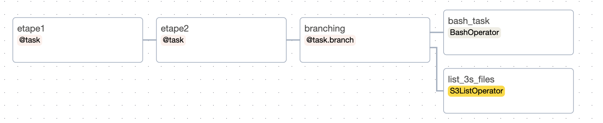

# TP Airflow


## Exercice 1 : Installer et lancer Airflow

- Lancer un service jupyter-notebook avec le port 5000 d'ouvert

- Installez Apache Airflow (apache-airflow) en utilisant pip

> *Attention : ajouter un paquet ubuntu manquant (`sudo apt update && sudo apt install -y tzdata`)*

- se placer dans le dossier `work` et lancer dans un terminal le scheduler
- Lancer dans un autre terminal le webserver sur le port `5000`

- Créer un dossier `dags` dans votre répértoire

- Changer dans la configuration airflow

`dags_folder = /home/onyxia/work/dags`

- Lancer la commande suivante pour créer un utilisateur :

```
airflow users  create --role Admin --username admin --email admin --firstname admin --lastname admin --password airflow1234!
```

- Connecter vous ensuite à airflow via l'url exposé sur le port 5000

## Exercice 2 : Lancer un dag

- Ecrire un dag qui lance deux task python successives qui affichent "OK"

```python
import pendulum
from airflow.decorators import dag, task


@task()
def etape1():
    print('OK')

@task()
def etape2():
    print('OK')

@dag("test_dag",
    schedule=None,
    start_date=pendulum.datetime(2021, 1, 1, tz="UTC"),
    catchup=False,
    tags=["example"],
)
def test():
    a = etape1()
    b = etape2()

    a >> b

test()
```

Lancer ce dag manuellement dans l'interface utilisateur puis trouver dans les logs la valeur affichée.

## Exercice 3 : Planification d'un DAG

Modifiez le DAG pour planifier l'exécution quotidienne toutes les 10 minutes (le site `crontab.guru` pourra vous aider).


## Exercice 4 : Utilisation d'un opérateur

Ajoutez une troisième tâche au DAG qui exécute la commande linux : `date` (avec [BashOperator](https://airflow.apache.org/docs/apache-airflow/stable/_api/airflow/operators/bash/index.html)).

Relancer le dag manuellement.


## Exercice 5 : Les XComs

Modifiez le DAG pour que la première tache retourne la valeur `1` et que la seconde tâche utilise le résultat de la première tâche en tant que paramètre et lui ajoute `10`. Relancer le dag manuellement.

Trouver la valeur du XCom de la première tâche dans l'interface Airflow.


## Exercice 6 : Variabiliser les DAGs

Ajouter une variable airflow dans l'UI dont le nom est `numero` et sa valeur est `1`. Faite retourner la valeur de la variable dans la première tache du DAG ([documentation](https://airflow.apache.org/docs/apache-airflow/stable/core-concepts/variables.html)).

Où faut t'il placer la récupération de la valeur de la variable ? Pourquoi ?

*Note : consulter les best pratices Airflow dans la documentation*


## Exercice 7 : Ajouter une connexion et l'utiliser

1. Installer le provider amazon S3 `pip install 'apache-airflow[amazon]'` et modifier  dans le fichier `airflow.cfg` le paramètre `test_connection = Enabled`

2. Relancer le webserver et le scheduler

1. Ajouter une connexion au stockage S3 de la plateforme appelée `minio`  ([documentation](https://airflow.apache.org/docs/apache-airflow-providers-amazon/stable/connections/aws.html)). *Attention : le test de connexion ne fonctionne pas avec minio.*


3. Ajouter une étape dans votre DAG qui utilise l'operator S3 pour lister les objets de votre bucket ([documentation](https://airflow.apache.org/docs/apache-airflow-providers-amazon/3.2.0/_api/airflow/providers/amazon/aws/operators/s3/index.html#airflow.providers.amazon.aws.operators.s3.S3ListOperator)). Observer le XComs.


## Exercice 8 : Lancer des requêtes SQL

1. Installer le provider postgreSQL `pip install apache-airflow-providers-postgres` et rédémarrer le webserver

1. Créer un service PostgreSQL dans le SSPCloud

2. Ajouter une connexion à la base de données

3. Utiliser l'ExecuteQueryOperator ([documentation](https://airflow.apache.org/docs/apache-airflow-providers-common-sql/stable/operators.html)) qui lance la commande `select 0`


## Exercice 9 : Créer des conditions dans vos DAG


Créer une `task branch` qui lance la tâche BashOperator si nous sommes le week-end, sinon lance la tâche qui liste les fichiers sur S3.

```python
@task.branch
def branching():
    import datetime
    week = datetime.datetime.today().weekday()
    if week > 5:
        return "bash_task"
    return "list_s3_files"
```

Appliquer les dépendances pour les faire correspondre au schéma suivant




## Exercice 10 : Créer une alimentation de données

Faire un DAG qui :

- Lance une requête SQL pour créer une table avec un schéma de la table souhaité
- Liste les fichiers sur S3 dans votre bucket
- Dans une task python, lit la liste des fichiers de la première étape et selectionne le fichier
- Importer les données dans la base de données


